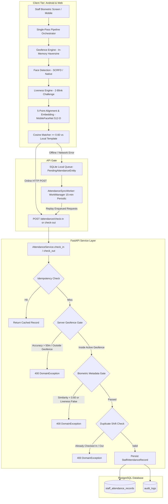
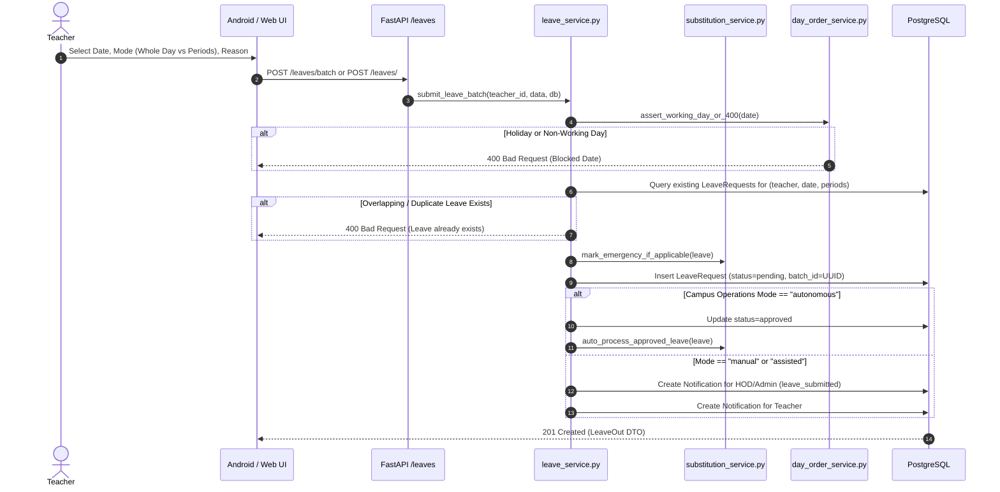
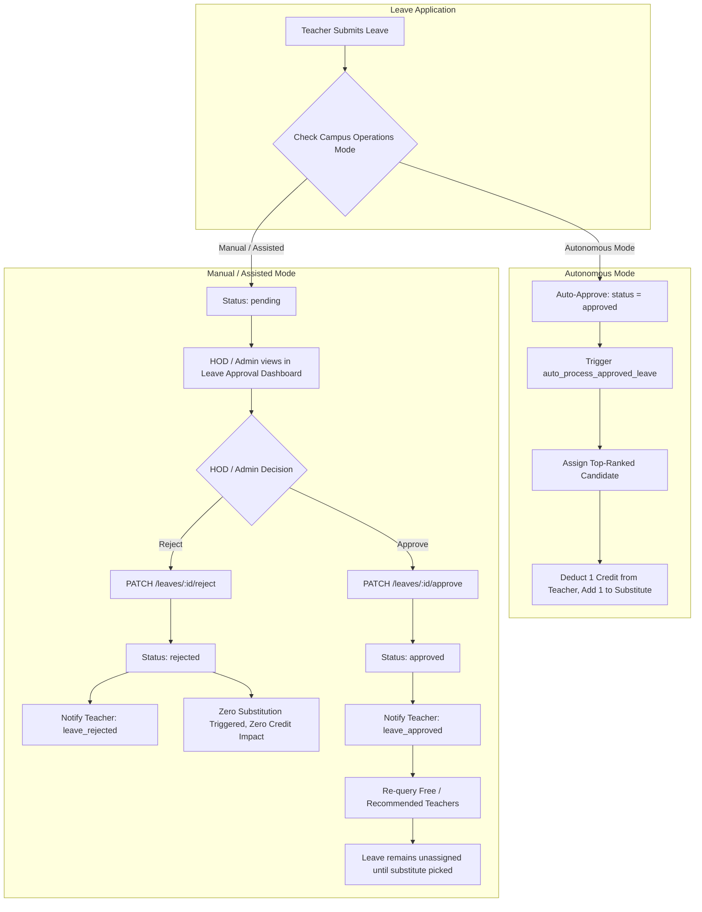
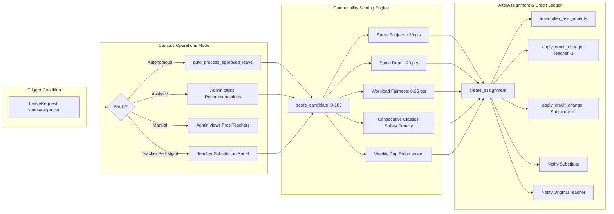

# FAFLOW Technical & Functional Code-Level Audit: Attendance & Leave Workflows

> **Document Status**: Authoritative "AS-IS" Architectural & Workflow Mapping  
> **Target Systems**: Web/Admin (React), Android Client (Kotlin + Jetpack Compose), Backend (FastAPI), Database (PostgreSQL + SQLAlchemy)  
> **Date of Audit**: September 2026  
> **Scope**: Code-level audit without modifying application code, schema migrations, or operational data.

---

## 1. Current Attendance Workflow

Trace from the user interface to the database across Android, Web, FastAPI backend, and PostgreSQL database.



### A. Android Staff Attendance

#### 1. How a teacher/staff member opens attendance
* **Entry Point**: The staff member opens the app and navigates from [DashboardScreen.kt](file:///b:/android/app/src/main/java/com/governence/faflow/ui/screens/DashboardScreen.kt) or the bottom navigation bar to [AttendanceCheckInOutScreen.kt](file:///b:/android/app/src/main/java/com/governence/faflow/ui/screens/AttendanceCheckInOutScreen.kt).
* **Pre-requisite Initialization**: [AttendanceViewModel.kt](file:///b:/android/app/src/main/java/com/governence/faflow/ui/viewmodels/AttendanceViewModel.kt#L143-L200) calls `loadTodayAttendanceStatus()`. This initializes:
  * Camera preview controller via [CameraController.kt](file:///b:/android/app/src/main/java/com/governence/faflow/camera/CameraController.kt).
  * Campus geofence cache fetched from [GeofenceRepository.kt](file:///b:/android/app/src/main/java/com/governence/faflow/faflow/data/GeofenceRepository.kt).
  * Device GPS location provider via [StaffLocationProvider.kt](file:///b:/android/app/src/main/java/com/governence/faflow/attendance/geolocation/StaffLocationProvider.kt).
  * Device hardware integrity verifier via [DeviceIntegrityVerifier.kt](file:///b:/android/app/src/main/java/com/governence/faflow/core/security/DeviceIntegrityVerifier.kt).

#### 2. What attendance types currently exist
* **Staff Shift Types**: The database schema ([staff_attendance.py:L17](file:///b:/FAFLOW_UNIFIED/backend/app/models/staff_attendance.py#L17)) defines:
  * `PRESENT` (Default authoritative on-duty status).
  * `HALF_DAY` (Documented in enum comments, but not auto-computed on check-in).
  * `LATE` (Documented in enum comments, but not auto-computed on check-in).
  * `ON_DUTY` (Documented in enum comments, reserved for administrative duty).
* **Underlying Check-In/Check-Out Operation Types**:
  * `CHECK_IN`: Morning/shift start arrival receipt.
  * `CHECK_OUT`: Shift conclusion departure receipt with working duration calculation.

#### 3. How staff attendance is captured
* Captured via the Android native front-facing camera using a single-pass processing loop orchestrated by [AttendancePipelineOrchestrator.kt:L57](file:///b:/android/app/src/main/java/com/governence/faflow/attendance/pipeline/AttendancePipelineOrchestrator.kt#L57).
* The user positions their face inside a guide oval overlaid on [CameraPreviewView.kt](file:///b:/android/app/src/main/java/com/governence/faflow/camera/CameraPreviewView.kt). Once valid positioning, liveness, and campus location criteria are met, frame capture is frozen and submitted automatically or via manual confirmation.

#### 4. Face enrollment flow
* **Screen**: [FaceEnrollmentScreen.kt](file:///b:/android/app/src/main/java/com/governence/faflow/ui/screens/FaceEnrollmentScreen.kt).
* **Pipeline**:
  1. SCRFD face detector locates the face and outputs 5 landmarks (left eye, right eye, nose tip, left mouth corner, right mouth corner).
  2. [SimilarityFaceAligner.kt](file:///b:/android/app/src/main/java/com/governence/faflow/attendance/biometrics/alignment/SimilarityFaceAligner.kt) aligns the face geometry into a canonical `112x112` crop.
  3. The user clicks "Confirm Biometric Enrollment". The device captures 3 successive face samples separated by 200ms delays ([FaceEnrollmentScreen.kt:L327-L344](file:///b:/android/app/src/main/java/com/governence/faflow/ui/screens/FaceEnrollmentScreen.kt#L327-L344)).
  4. [MobileFaceNetEmbedder.kt](file:///b:/android/app/src/main/java/com/governence/faflow/attendance/biometrics/embedding/MobileFaceNetEmbedder.kt) extracts a 512-dimensional float vector for each sample.
  5. Pairwise consistency verification is performed: cosine similarity between sample 1, sample 2, and sample 3 must each be `>= 0.60`.
  6. The 3 vectors are averaged and L2-normalized:
     $$\mathbf{e}_{\text{final}} = \frac{\mathbf{e}_1 + \mathbf{e}_2 + \mathbf{e}_3}{\|\mathbf{e}_1 + \mathbf{e}_2 + \mathbf{e}_3\|_2}$$
  7. **Local Storage**: The resulting 512-D vector is encrypted via `AES-256-GCM` inside `EncryptedSharedPreferences` under key `"enrollment_{staffId}"` by [LocalFaceEnrollmentRepository.kt](file:///b:/android/app/src/main/java/com/governence/faflow/attendance/biometrics/enrollment/FaceEnrollmentRepository.kt#L68).
  8. **Backend Registration**: Mobile calls `POST /teachers/me/biometrics/enroll` or `POST /staff/me/biometrics/enroll`, setting `current_user.has_face_enrolled = True` and recording `face_enrolled_at`. **Zero raw face images or embedding vectors are ever transmitted to or stored on the backend server.**

#### 5. Face verification/check-in flow
* When the staff member triggers check-in, [AttendancePipelineOrchestrator.kt](file:///b:/android/app/src/main/java/com/governence/faflow/attendance/pipeline/AttendancePipelineOrchestrator.kt#L57) executes the following sequential pipeline:
  1. **Geofence Check**: Asserts the user's GPS fix is within an active campus geofence.
  2. **Face Detection**: Runs [ScrfdFaceDetector.kt](file:///b:/android/app/src/main/java/com/governence/faflow/attendance/biometrics/scrfd/ScrfdFaceDetector.kt).
  3. **Liveness Evaluation**: Runs [LivenessEngine.kt](file:///b:/android/app/src/main/java/com/governence/faflow/attendance/biometrics/liveness/LivenessEngine.kt). Must reach `LivenessState.Passed`.
  4. **Face Alignment**: Computes 5-point similarity transformation to standard 112x112 coordinate space.
  5. **Feature Extraction**: Extracts 512-D float embedding using MobileFaceNet.
  6. **Cosine Similarity Matching**: [CosineFaceMatcher.kt](file:///b:/android/app/src/main/java/com/governence/faflow/attendance/biometrics/matching/CosineFaceMatcher.kt) computes:
     $$\text{sim}(\mathbf{u}, \mathbf{v}) = \frac{\mathbf{u} \cdot \mathbf{v}}{\|\mathbf{u}\|_2 \|\mathbf{v}\|_2}$$
     Match threshold is `0.60`. If `similarity >= 0.60`, the staff member is verified.
  7. **Submission**: Calls `attendanceRepository.checkIn(...)` with GPS coordinates, accuracy, similarity score, and a client-generated UUID idempotency key.

#### 6. Face verification/check-out flow
* Follows the **identical biometric and geolocation pipeline as check-in** ([AttendanceService.py:L165-L180](file:///b:/FAFLOW_UNIFIED/backend/app/services/attendance_service.py#L165-L180)).
* Re-verifies facial identity and liveness to prevent session hijacking.
* Validates that a check-in record for today exists.
* Computes working duration:
  $$\Delta t = t_{\text{check\_out}} - t_{\text{check\_in}}$$
  Formats string as `"{H}h {M}m"` and stores it in `staff_attendance_records.working_hours`.

#### 7. Liveness detection flow
* Implemented in [LivenessEngine.kt](file:///b:/android/app/src/main/java/com/governence/faflow/attendance/biometrics/liveness/LivenessEngine.kt) and [ActiveLivenessDetector.kt](file:///b:/android/app/src/main/java/com/governence/faflow/attendance/biometrics/liveness/ActiveLivenessDetector.kt).
* **Challenge Mechanism**: An active interactive challenge requiring **2 consecutive natural eye blinks** detected via Eye Aspect Ratio (EAR):
  $$\text{EAR} = \frac{\|p_2 - p_6\| + \|p_3 - p_5\|}{2 \|p_1 - p_4\|}$$
* **Thresholds**:
  * Eye closed threshold: `EAR <= 0.20`
  * Eye open threshold: `EAR >= 0.28`
  * Minimum blink duration: 50ms, maximum: 400ms.
* **Passive Anti-Spoofing Defense**:
  * Evaluates temporal landmark variance across consecutive frames to reject static photographs.
  * Rejects frames where inter-ocular distance fluctuates abnormally (screen replay detection).
  * State transitions: `WaitingForFace` $\rightarrow$ `ChallengeActive` (prompting "Blink 2 times") $\rightarrow$ `Passed` or `SpoofSuspected` or `TimedOut` (default 5.0 seconds).
  * **Fail-Closed Contract**: Unless state is explicitly `LivenessState.Passed`, the pipeline rejects check-in.

#### 8. Camera processing pipeline
* Built on Android CameraX (`androidx.camera.core.ImageAnalysis`) via [CameraController.kt](file:///b:/android/app/src/main/java/com/governence/faflow/camera/CameraController.kt).
* Runs at a target rate of 10–15 FPS.
* Converts `ImageProxy` (YUV_420_888 format) to RGB Bitmap.
* Applies rotation compensation based on device sensor orientation.
* Pipes frames to SCRFD ONNX Runtime/TFLite inference engine.

#### 9. Location/geofence validation
* **Client-Side Validation**: [GeofenceEngine.kt](file:///b:/android/app/src/main/java/com/governence/faflow/attendance/geolocation/GeofenceEngine.kt) caches active campus geofence polygons/circles fetched from `GET /geofences/active`.
  * Computes Great-Circle distance using Haversine formula:
    $$d = 2r \arcsin \left( \sqrt{\sin^2\left(\frac{\Delta\phi}{2}\right) + \cos\phi_1\cos\phi_2\sin^2\left(\frac{\Delta\lambda}{2}\right)} \right)$$
  * Allows a boundary buffer: `distance <= (radius_meters + tolerance_meters)`.
* **Server-Side Validation**: [AttendanceService.py:L52-L72](file:///b:/FAFLOW_UNIFIED/backend/app/services/attendance_service.py#L52-L72) re-validates the submitted `(latitude, longitude, accuracy_meters)`:
  * Rejects if `accuracy_meters > 50.0m` (DomainException 400).
  * Evaluates all active geofences in `campus_geofences`. If outside all zones, check-in is rejected with HTTP 400.

#### 10. Online vs offline attendance behavior
* **Online Flow**: Submits JSON directly to `POST /attendance/check-in`. Returns `AttendanceRecordOut` within < 500ms.
* **Offline Flow**: When network connectivity fails or timeouts occur:
  * [AttendanceRepository.kt:L74-L93](file:///b:/android/app/src/main/java/com/governence/faflow/attendance/data/AttendanceRepository.kt#L74-L93) catches the exception.
  * Encapsulates the verified biometric metadata receipt into a [PendingAttendanceEntity](file:///b:/android/app/src/main/java/com/governence/faflow/attendance/data/PendingAttendanceEntity.kt).
  * Persists the record into local SQLite database [AttendanceLocalQueue.kt](file:///b:/android/app/src/main/java/com/governence/faflow/attendance/data/AttendanceLocalQueue.kt).
  * Sets state to `AttendanceEligibilityState.SavedOffline` ("Check-in verified locally. Queued for automatic institutional synchronization").

#### 11. Error handling matrix

| Scenario | System Behavior & User Feedback |
|---|---|
| **Face not recognized** | `AttendancePipelineResult.BiometricMismatch` emitted. UI displays `StatusError`: "Face not recognized. Similarity score below institutional threshold (0.60)". No API call dispatched. |
| **Liveness fails** | `AttendancePipelineResult.LivenessFailed` emitted. UI indicates: "Presentation attack detected" or "Liveness challenge timed out". Fail-closed: check-in denied. |
| **Location outside allowed area** | Client blocks submission with `AttendancePipelineResult.GeofenceRejected` ("Outside campus perimeter: {distance}m from nearest zone"). If bypassed, server rejects with HTTP 400 ("Location verification failed: Staff member is outside institutional campus geofence perimeters"). |
| **Internet unavailable** | Biometric and location validation complete on-device; transaction saved to local SQLite queue `pending_attendance`; WorkManager job scheduled. |
| **Server unavailable (5xx)** | Request falls back to local SQLite queue; marked `PENDING` for future replay. |
| **User already checked in** | Backend returns HTTP 400: `"Staff member is already checked in for today ({date})"`. (Can be bypassed in test environments if `ALLOW_UNLIMITED_ATTENDANCE_TESTING=true`). |
| **User already checked out** | Backend returns HTTP 400: `"Staff member is already checked out for today ({date})"`. |

#### 12. How attendance status is calculated
* Backend hardcodes `status = "PRESENT"` upon check-in ([AttendanceService.py:L131](file:///b:/FAFLOW_UNIFIED/backend/app/services/attendance_service.py#L131)).
* The supervisor overview ([AttendanceService.py:L264-L305](file:///b:/FAFLOW_UNIFIED/backend/app/services/attendance_service.py#L264-L305)) computes:
  * `checked_in_count`: Staff with `check_in_time IS NOT NULL AND check_out_time IS NULL`.
  * `checked_out_count`: Staff with `check_out_time IS NOT NULL`.
  * `absent_count`: `total_active_staff - (checked_in + checked_out)`.

#### 13. How attendance timestamps are stored
* Stored in PostgreSQL table `staff_attendance_records` as timezone-aware UTC timestamps (`DateTime(timezone=True)`).
* `attendance_date` stores pure date (`Date`), matching institutional operational day.

#### 14. How attendance is synchronized from offline storage to backend
* Managed by [AttendanceSyncWorker.kt](file:///b:/android/app/src/main/java/com/governence/faflow/attendance/sync/AttendanceSyncWorker.kt) using Android `WorkManager`:
  * **Immediate Sync**: Triggered on network reconnect (`triggerImmediateSync(context)`) with `NetworkType.CONNECTED` constraint.
  * **Periodic Sync**: Scheduled every 15 minutes (`schedulePeriodicSync(context)`).
  * Worker reads records from [AttendanceLocalQueue.kt](file:///b:/android/app/src/main/java/com/governence/faflow/attendance/data/AttendanceLocalQueue.kt) where `sync_status IN ('PENDING', 'SYNCING')`.
  * Sends requests with the original `idempotency_key`. Upon HTTP 200, marks record `SYNCED`. If HTTP 4xx (e.g. duplicate), updates status and records error.

#### 15. API endpoints called
* `POST /attendance/check-in`
* `POST /attendance/check-out`
* `GET /attendance/today`
* `GET /attendance/my`
* `GET /attendance/admin/live-status`
* `POST /teachers/me/biometrics/enroll`
* `POST /staff/me/biometrics/enroll`
* `POST /teachers/{teacher_id}/biometrics/reset`

#### 16. Database tables involved
* `staff_attendance_records`
* `campus_geofences`
* `users`
* `audit_logs`

---

### B. Student Attendance

```mermaid
flowchart TD
    subgraph Timetable [Timetable & Schedule Resolution]
        T1[Teacher opens Student Attendance UI] --> T2[GET /student-attendance/today]
        T2 --> T3[day_order_calendar: Resolve CalendarDay for Date]
        T3 -->|If Blocked/Holiday| T4[Return is_blocked_date = True]
        T3 -->|If Working Day| T5[Find TimetableSlots for Teacher & DayOrder]
        T5 --> T6[Find Approved AlterAssignments for Teacher today]
        T6 --> T7[Return Scheduled Slots + Substitutions]
    end

    subgraph Roster [Class Roster Loading]
        R1[Teacher selects slot/class] --> R2[GET /student-attendance/classes/:id/roster]
        R2 --> R3[EffectiveMembershipService: Query students active in class]
        R3 --> R4[Format roster with 3-digit roll suffixes]
    end

    subgraph Submit [Attendance Marking]
        S1[Teacher enters absent 3-digit suffixes e.g. 004, 012] --> S2[POST /student-attendance/sessions/submit]
        S2 --> S3{Check Constraints & Existing Session}
        S3 -->|Already Submitted| S4[409 Conflict]
        S3 -->|Period > 5 or < 1| S5[400 CheckConstraint Violation]
        S3 -->|Valid| S6[Evaluate 15-min Timing Rule]
        S6 -->|Submitted <= Period Start + 15m| S7[Status: submitted]
        S6 -->|Submitted > Period Start + 15m| S8[Status: submitted_late]
        S7 & S8 --> S9[Persist AttendanceSession]
        S9 --> S10[Persist StudentAttendance records: Present by default, Absent for listed suffixes]
        S10 --> S11[Async Daemon Thread: AcademicIntelligenceService.evaluate_session_async]
    end
```



#### 1. How teacher selects a class
* In Android [StudentAttendanceScreen.kt](file:///b:/android/app/src/main/java/com/governence/faflow/ui/screens/StudentAttendanceScreen.kt) and Web [StudentAttendance.jsx](file:///b:/FAFLOW_UNIFIED/frontend/src/pages/teacher/StudentAttendance.jsx):
  * Calls `GET /student-attendance/today`.
  * Screen renders three sections:
    1. **Scheduled Classes**: Native timetable slots for today's Day Order.
    2. **Registered Substitutions**: Classes assigned to the teacher via approved leave substitutions.
    3. **Emergency Class Picker**: Full directory of institutional classes for emergency coverage.
  * Clicking any card selects that `(class_id, period_number, subject_id, timetable_slot_id)`.

#### 2. How timetable determines the current class/period
* The backend resolves the current calendar date against `calendar_days`.
* If not a blocked day, it extracts `calendar_days.day_order` (integer 1..6).
* Queries `timetable_slots` where `teacher_id == current_user.id AND day_order == calendar_days.day_order`.
* Compares current UTC time against standard period schedule ([student_attendance_service.py:L39-L45](file:///b:/FAFLOW_UNIFIED/backend/app/services/student_attendance_service.py#L39-L45)):
  * Period 1: 08:00 – 09:00
  * Period 2: 09:00 – 10:00
  * Period 3: 10:15 – 11:15
  * Period 4: 11:15 – 12:15
  * Period 5: 13:00 – 14:00

#### 3. How students are loaded
* Client calls `GET /student-attendance/classes/{class_id}/roster`.
* Handled by [EffectiveMembershipService.py](file:///b:/FAFLOW_UNIFIED/backend/app/services/effective_membership_service.py), resolving active students enrolled in the class through `students` and `student_enrollments`.
* Returns list of students sorted by roll number.

#### 4. How students are identified
* Each student has:
  * `id`: Integer primary key.
  * `name`: String student name.
  * `roll_number`: Full institutional roll number (e.g. `"21CS042"`).
  * `roll_suffix`: 3-digit normalized suffix string (e.g. `"042"`).

#### 5. Current roll-number handling
* Optimized for fast entry: teachers do not tap each student. Instead, they enter **only absent roll number suffixes** (e.g. `"004, 012, 045"`).
* [StudentAttendanceService.normalize_roll_suffixes()](file:///b:/FAFLOW_UNIFIED/backend/app/services/student_attendance_service.py#L87-L105) splits on commas, spaces, or newlines, and normalizes values to 3 digits using `.zfill(3)`.

#### 6. How attendance is marked
* **Present by Default**: All active students enrolled in the class are automatically marked `present` unless their roll number or 3-digit suffix is included in `absent_roll_suffixes` or `exceptions`.
* The server wipes and inserts rows in `student_attendance` within a single database transaction.

#### 7. Present/absent/other statuses currently supported
* Enforced by PostgreSQL enum `student_attendance_status` ([student_attendance.py:L25-L32](file:///b:/FAFLOW_UNIFIED/backend/app/models/student_attendance.py#L25-L32)):
  1. `present`
  2. `absent`
  3. `late`
  4. `on_duty`
  5. `leave`
  6. `medical`

#### 8. Whether attendance can be edited
* **Teacher In-Window Correction**: Yes. The submitting teacher can call `PATCH /student-attendance/sessions/{id}/students/{student_id}` to change an individual student's status without administrator intervention, **provided the correction window has not expired** ([student_attendance_service.py:L704-L768](file:///b:/FAFLOW_UNIFIED/backend/app/services/student_attendance_service.py#L704-L768)).
* **Window Duration**: Configured via `SystemSetting` key `student_attendance_correction_window_hours` (default is **24 hours** from submission).
* **Audit Trail**: Every change creates an immutable audit row in `attendance_correction_audits` tracking `old_status`, `new_status`, `changed_by_id`, `reason`, and timestamp.
* **Administrative Override**: Admins and Principals can override attendance at any time via `POST /student-attendance/principal/sessions/{id}/students/{student_id}/override`.

#### 9. Whether attendance can be submitted multiple times
* **No**. The database enforces a unique constraint:
  `UniqueConstraint("attendance_date", "class_id", "period_number", name="uq_session_date_class_period")`
* If a session is already in `submitted`, `submitted_late`, or `locked` status, any subsequent submission attempt raises an **HTTP 409 Conflict** error ([student_attendance_service.py:L435-L440](file:///b:/FAFLOW_UNIFIED/backend/app/services/student_attendance_service.py#L435-L440)).

#### 10. How bunking/absence is currently represented
* Individual period absence is recorded as `status = 'absent'` in `student_attendance`.
* **Bunking (Drop) Detection**: Evaluated automatically in a daemon background thread by [AcademicIntelligenceService.py:L177-L230](file:///b:/FAFLOW_UNIFIED/backend/app/services/academic_intelligence_service.py#L177-L230). If a student was present in Period 1 or 2, but attendance in Period 3 or 4 drops by $\ge 15\%$, an `attendance_drop` event is created in `academic_intelligence_events`.

#### 11. How hour-wise attendance is stored
* Stored per period (hour 1 through 5) in two tables:
  * `attendance_sessions`: One record per class, period, and date.
  * `student_attendance`: One record per student per `attendance_session_id`.

#### 12. How the system determines the academic day/day order
* Evaluates `calendar_days` table via [day_order_service.py](file:///b:/FAFLOW_UNIFIED/backend/app/services/day_order_service.py).
* Each row specifies `date`, `day_order` (1..6), and `day_type` (`instructional`, `holiday`, `exam`, `sunday`, `semester_break`).
* If `day_type` is in `BLOCKING_DAY_TYPES`, attendance submission is blocked.

#### 13. How subject/class/teacher/period are connected
* Linked through `attendance_sessions`:
  * `class_id` $\rightarrow$ `classes.id`
  * `subject_id` $\rightarrow$ `subjects.id`
  * `period_number` $\rightarrow$ Integer 1 to 5 (enforced by `CheckConstraint("period_number BETWEEN 1 AND 5")`)
  * `scheduled_teacher_id` $\rightarrow$ `users.id`
  * `actual_teacher_id` $\rightarrow$ `users.id`
  * `timetable_slot_id` $\rightarrow$ `timetable_slots.id` (nullable for emergency attendance)
  * `substitution_id` $\rightarrow$ `alter_assignments.id` (nullable)

#### 14. API endpoints involved
* `GET /student-attendance/today`
* `GET /student-attendance/classes/{class_id}/roster`
* `GET /student-attendance/sessions/{id}`
* `POST /student-attendance/sessions`
* `POST /student-attendance/sessions/submit`
* `POST /student-attendance/sessions/{id}/submit`
* `POST /student-attendance/emergency`
* `PATCH /student-attendance/sessions/{id}/students/{student_id}`
* `POST /student-attendance/sync`

#### 15. Database tables involved
* `attendance_sessions`
* `student_attendance`
* `attendance_correction_audits`
* `classes`
* `students`
* `student_enrollments`
* `subjects`
* `timetable_slots`
* `calendar_days`
* `alter_assignments`
* `academic_intelligence_events`

---

### C. HOD / Principal Attendance View

| View / Feature | Backend Implementation | Web UI Status | Android UI Status | Real vs UI Placeholder |
|---|---|---|---|---|
| **HOD Attendance Dashboard** | `GET /student-attendance/hod/overview` | [HodStudentAttendance.jsx](file:///b:/FAFLOW_UNIFIED/frontend/src/pages/admin/HodStudentAttendance.jsx) | [HodAttendanceScreen.kt](file:///b:/android/app/src/main/java/com/governence/faflow/ui/screens/HodAttendanceScreen.kt) | ✅ **ACTUALLY IMPLEMENTED**: Aggregates departmental attendance rate, conducted classes, late submissions, and exceptions. |
| **Principal Attendance Dashboard** | `GET /student-attendance/principal/overview` | [PrincipalStudentAttendance.jsx](file:///b:/FAFLOW_UNIFIED/frontend/src/pages/admin/PrincipalStudentAttendance.jsx) | None (Mobile has HOD screen only) | ✅ **ACTUALLY IMPLEMENTED** on Web. Institutional macro metrics across all departments. |
| **Staff Live Shift Tracking** | `GET /attendance/admin/live-status` | [AdminAttendance.jsx](file:///b:/FAFLOW_UNIFIED/frontend/src/pages/admin/Attendance.jsx) | [AttendanceCheckInOutScreen.kt](file:///b:/android/app/src/main/java/com/governence/faflow/ui/screens/AttendanceCheckInOutScreen.kt) | ✅ **ACTUALLY IMPLEMENTED**: Live count of checked-in, checked-out, and absent faculty with auto-refresh. |
| **Student Attendance Records** | `GET /student-attendance/sessions/{id}` | [HodStudentAttendance.jsx](file:///b:/FAFLOW_UNIFIED/frontend/src/pages/admin/HodStudentAttendance.jsx) | [StudentAttendanceScreen.kt](file:///b:/android/app/src/main/java/com/governence/faflow/ui/screens/StudentAttendanceScreen.kt) | ✅ **ACTUALLY IMPLEMENTED**: Full student-level drill down by session. |
| **Class-by-Period Matrix** | `GET /student-attendance/principal/classes/{class_id}/matrix` | [PrincipalStudentAttendance.jsx](file:///b:/FAFLOW_UNIFIED/frontend/src/pages/admin/PrincipalStudentAttendance.jsx) | None | ✅ **ACTUALLY IMPLEMENTED**: Grid showing periods 1–5 for every student on a given date. |
| **Individual Student Profile & History** | `GET /student-attendance/principal/students/{student_id}` | [PrincipalStudentAttendance.jsx](file:///b:/FAFLOW_UNIFIED/frontend/src/pages/admin/PrincipalStudentAttendance.jsx) | None | ✅ **ACTUALLY IMPLEMENTED**: Detailed subject-wise breakdown, shortage alert indicator, and session history. |
| **Teacher Submission Compliance** | `GET /student-attendance/principal/teacher-compliance` | [PrincipalStudentAttendance.jsx](file:///b:/FAFLOW_UNIFIED/frontend/src/pages/admin/PrincipalStudentAttendance.jsx) | None | ✅ **ACTUALLY IMPLEMENTED**: Tracks on-time vs late submissions (<15m vs >15m) and missed sessions. |
| **Reports / CSV Export** | `GET /student-attendance/principal/export` | [PrincipalStudentAttendance.jsx:L142-L165](file:///b:/FAFLOW_UNIFIED/frontend/src/pages/admin/PrincipalStudentAttendance.jsx#L142-L165) | None | ✅ **ACTUALLY IMPLEMENTED**: Generates downloadable CSV exports for daily summary, shortage lists, compliance, and session history. |
| **Administrative Session Lock / Unlock** | `POST /student-attendance/principal/sessions/{id}/lock` | [PrincipalStudentAttendance.jsx:L218-L242](file:///b:/FAFLOW_UNIFIED/frontend/src/pages/admin/PrincipalStudentAttendance.jsx#L218-L242) | None | ✅ **ACTUALLY IMPLEMENTED**: Locks session to prevent any teacher corrections. |
| **Administrative Attendance Override** | `POST /student-attendance/principal/sessions/{id}/students/{student_id}/override` | [PrincipalStudentAttendance.jsx:L244-L270](file:///b:/FAFLOW_UNIFIED/frontend/src/pages/admin/PrincipalStudentAttendance.jsx#L244-L270) | None | ✅ **ACTUALLY IMPLEMENTED**: Allows Principal/Admin to overwrite student mark with mandatory justification. |
| **Bunking & Drop Alerts** | Background evaluation via `AcademicIntelligenceService` | [HodStudentAttendance.jsx](file:///b:/FAFLOW_UNIFIED/frontend/src/pages/admin/HodStudentAttendance.jsx), [PrincipalStudentAttendance.jsx](file:///b:/FAFLOW_UNIFIED/frontend/src/pages/admin/PrincipalStudentAttendance.jsx) | None | ✅ **ACTUALLY IMPLEMENTED**: Automatically flags attendance drops $\ge 15\%$ and absenteeism $\ge 25\%$. |

---

## 2. Current Leave Application Workflow

### Teacher Leave Application Trace



#### 1. Where the teacher applies for leave
* **Android**: [ApplyLeaveScreen.kt](file:///b:/android/app/src/main/java/com/governence/faflow/ui/screens/ApplyLeaveScreen.kt).
* **Web**: [ApplyLeave.jsx](file:///b:/FAFLOW_UNIFIED/frontend/src/pages/teacher/ApplyLeave.jsx).
* **Admin on behalf of teacher**: [AdminLeaveEntry.jsx](file:///b:/FAFLOW_UNIFIED/frontend/src/pages/admin/AdminLeaveEntry.jsx) (`POST /leaves/admin-create`).

#### 2. Leave types currently supported
* **Teacher/Faculty Leave**: **Period-Based Absence**. Faculty leave does **NOT** use conventional types like "casual", "sick", or "earned" at the database level. [LeaveRequest](file:///b:/FAFLOW_UNIFIED/backend/app/models/leave.py) models leave as specific period slot absences (Period 1–5).
* **Non-Teaching / Operational Staff**: Uses conventional leave types via [StaffLeaveRequest](file:///b:/FAFLOW_UNIFIED/backend/app/models/staff_leave.py): `casual`, `medical`, `earned`, `on_duty`, `compensatory_off`, `other`.

#### 3. Available leave balances
* **Teachers have NO conventional annual leave quota!** Instead, teachers operate under a **Credit Ledger System** ([credit.py](file:///b:/FAFLOW_UNIFIED/backend/app/models/credit.py)):
  * Teacher balance starts at `0` in table `teacher_credits`.
  * Deducted by `-1` credit when a substitute covers their class (`substitute_class`).
  * Credited with `+1` credit when they substitute for a colleague.
  * Teachers can apply for leave regardless of whether their credit balance is positive or negative.
* Operational Staff have an annual quota (`annual_quota = 12.0`, `balance = 12.0` in `staff_credits`).

#### 4. How leave dates are selected
* Selected via date picker (`YYYY-MM-DD`).
* As soon as a date is chosen, client calls `GET /academic-calendar/resolve-date/{date}` to determine if the date is a working day, its Day Order, and if operations are blocked.

#### 5. Half-day / full-day handling
* **Whole Day**: Teacher toggles "Whole Day". The system queries `timetable_slots` for that teacher on that date's Day Order and generates leave rows **only for the specific periods the teacher is scheduled to teach** ([leave_service.py:L135-L147](file:///b:/FAFLOW_UNIFIED/backend/app/services/leave_service.py#L135-L147)).
* **Custom Periods**: Teacher selects individual period chips (e.g. Period 2 & 4).

#### 6. Reason/remarks fields
* Required text field: `reason = Column(String(500), nullable=False)`.
* UI provides quick-select presets: *"Personal reason"*, *"Medical leave"*, *"Conference attendance"*, *"Family event"*.

#### 7. Attachment support
* ❌ **NOT IMPLEMENTED**. Neither `LeaveRequest` nor `LeaveCreate` schema supports file attachments, documents, or medical certificates.

#### 8. Validation rules
1. **Working Day Enforcement**: Date must exist in `calendar_days` and not be a holiday or blocking day type ([leave_service.py:L33](file:///b:/FAFLOW_UNIFIED/backend/app/services/leave_service.py#L33)).
2. **Timetable Existence**: If "Whole Day" is requested, the teacher must have at least one scheduled slot on that Day Order.
3. **Duplicate Prevention**: Rejects if a leave request already exists for that `(teacher_id, date, period_number)` in `pending` or `approved` status.
4. **Period Bounds**: Enforced at database level by `CheckConstraint("period_number BETWEEN 1 AND 5")`.

#### 9. Whether overlapping leave is prevented
* **Yes**. Checked in [leave_service.py:L37-L50](file:///b:/FAFLOW_UNIFIED/backend/app/services/leave_service.py#L37-L50) and lines 172–186 before committing rows.

#### 10. Whether past-date leave is allowed
* **Teacher Submission**: Allowed at the API level for leave creation (often used for emergency retrospective regularization), but **cancellation of past-date leave is strictly blocked** ([leave_service.py:L759-L760](file:///b:/FAFLOW_UNIFIED/backend/app/services/leave_service.py#L759-L760)).
* **Admin Submission**: Admins can record retrospective leaves at any time via `POST /leaves/admin-create`.

#### 11. Whether leave can be cancelled
* **Yes, with strict time gating** ([leave_service.py:L738-L807](file:///b:/FAFLOW_UNIFIED/backend/app/services/leave_service.py#L738-L807)):
  * **Future Leaves** (`date > today`): Can be cancelled at any time by the teacher.
  * **Same-Day Leaves** (`date == today`): Can **only be cancelled before 10:00 AM** (`SAME_DAY_CANCEL_CUTOFF_HOUR = 10`).
  * **Past Leaves** (`date < today`): **Cannot be cancelled by the teacher**.
  * **Admin Cancellation**: Admins can cancel any leave at any time via `POST /leaves/{id}/admin-cancel` with a mandatory reason.

#### 12. Whether leave can be edited after submission
* ❌ **NOT IMPLEMENTED**. There is no endpoint or UI to edit an existing leave request. The teacher must cancel the request and submit a new one.

#### 13. What happens after submission
1. If campus operations mode is `"autonomous"`, the leave is **immediately auto-approved** and routed to the autonomous substitution engine ([leave_service.py:L54-L84](file:///b:/FAFLOW_UNIFIED/backend/app/services/leave_service.py#L54-L84)).
2. Otherwise, status is set to `pending`, and notifications are dispatched to department HODs and System Administrators (`event_type="leave_submitted"`).

---

## 3. Current Leave Approval Workflow



### Trace of Every Approval Path

1. **Who receives the leave request**:
   * All active users with role `admin` belonging to the teacher's department, plus institutional `system_admin` users ([leave_service.py:L87-L91](file:///b:/FAFLOW_UNIFIED/backend/app/services/leave_service.py#L87-L91)).
2. **Which role can approve**:
   * Users with role `admin` (Department HOD) or `system_admin` ([routes/leaves.py:L76-L82](file:///b:/FAFLOW_UNIFIED/backend/app/routes/leaves.py#L76-L82)).
   * In `"autonomous"` mode, the system auto-approves immediately.
3. **Which role can reject**:
   * Users with role `admin` (Department HOD) or `system_admin`.
4. **Whether multiple approval levels exist (e.g. Teacher $\rightarrow$ HOD $\rightarrow$ Principal)**:
   * ⚠️ **NO MULTI-LEVEL WORKFLOW IMPLEMENTED**. The current codebase implements **single-tier approval**. Once a departmental `admin` (HOD) approves, the leave status is final (`approved`). There is no second-tier approval required from the Principal.
5. **Whether approval is department-specific**:
   * **Yes**. Tenant scoping is enforced via dependency `get_tenant_department_id`:
     * Departmental HODs (`Role.admin`) can only view, approve, or reject leaves belonging to teachers in their own `department_id`.
     * Institutional admins (`Role.system_admin`) can approve across all departments.
6. **What happens when HOD approves**:
   * `leave_requests.status` transitions from `pending` $\rightarrow$ `approved`.
   * Notification `leave_approved` sent to the teacher.
   * If in `"autonomous"` mode, `auto_process_approved_leave` immediately assigns a substitute.
   * If in `"assisted"` or `"manual"` mode, the leave is approved but unassigned; the endpoint returns a list of free teachers for immediate assignment.
7. **What happens when HOD rejects**:
   * `leave_requests.status` transitions from `pending` $\rightarrow$ `rejected`.
   * Notification `leave_rejected` sent to the teacher.
   * No substitution is scheduled; no credits are touched.
8. **What happens when Principal approves/rejects**:
   * The Principal role (`Role.principal`) does not have route approval bindings in `routes/leaves.py`. Only `Role.admin` and `Role.system_admin` satisfy `require_admin`.
9. **Whether the teacher receives notifications**:
   * Yes, via database record in `notifications` and Web Push notification if subscribed.
10. **Whether leave balance changes immediately or only after approval**:
    * **NEITHER**. The teacher's credit balance changes **ONLY when a substitute teacher is assigned** to the class. An approved leave without an assigned substitute causes **0 credit change**.
11. **Whether timetable/substitution is triggered after approval**:
    * Yes. In autonomous mode, auto-assignment occurs immediately. In manual/assisted mode, the leave appears in the "Unassigned" substitution queue.
12. **Whether leave cancellation reverses the balance**:
    * **Yes**. `_reverse_assignment_if_exists()` credits `+1` to the teacher (category: `correction`) and deducts `-1` from the assigned substitute.
13. **Whether audit logs are generated**:
    * Yes. Every status change logs to `audit_logs` (e.g. `leave.auto_approved_by_system`, `substitution.admin_assigned`, `leave.cancelled_by_teacher`).

---

## 4. Leave $\rightarrow$ Substitution Connection

### Detailed Technical Trace



#### 1. Does an approved leave automatically create a substitution requirement?
* **Yes**. Every approved leave corresponds to a period slot that requires coverage.
* It remains in the "Uncovered / Unassigned" pool until an `AlterAssignment` is created.

#### 2. When is the substitution assignment generated?
* In **Autonomous Mode**: Generated **instantaneously** inside the same transaction as leave approval via `auto_process_approved_leave(db, leave)` ([substitution_service.py:L1147](file:///b:/FAFLOW_UNIFIED/backend/app/services/substitution_service.py#L1147)).
* In **Manual / Assisted Mode**: Generated when an admin selects a candidate and calls `POST /leaves/{id}/assign` or `POST /leaves/{id}/assign-recommended`.
* In **Teacher Self-Management Mode**: Generated when the teacher selects a colleague and calls `POST /teacher/substitution/leave/{id}/assign/{substitute_id}`.

#### 3. How are affected periods identified?
* Each `LeaveRequest` represents exactly **one period** (`period_number` 1–5). Multi-period leaves are submitted as batches of individual period rows sharing a `batch_id`.

#### 4. How is the class/subject/period determined?
* Determined by querying `timetable_slots` where `teacher_id == leave.teacher_id AND day_order == leave.day_order AND period_number == leave.period_number` ([substitution_service.py:L142-L170](file:///b:/FAFLOW_UNIFIED/backend/app/services/substitution_service.py#L142-L170)).

#### 5. How are eligible substitute teachers selected?
* Filtered via `_is_hard_eligible()` ([substitution_service.py:L318-L380](file:///b:/FAFLOW_UNIFIED/backend/app/services/substitution_service.py#L318-L380)) checking hard gates:
  1. Teacher is active and role is `teacher`.
  2. Not the teacher on leave (`substitute.id != leave.teacher_id`).
  3. No timetable class during that period (`timetable_slots`).
  4. No approved leave on that date and period.
  5. Not already substituting another class in that period (`alter_assignments`).
  6. Has not reached their weekly substitution cap (`substitution_preferences.max_weekly_substitutions`).
  7. If in autonomous mode, `accept_auto_assignments == True`.
  8. If `only_my_classes == True`, must already teach that class in the master timetable.

#### 6. Are teacher availability and timetable conflicts checked?
* **Yes**. Hard conflicts are strictly non-overridable:
  * Already teaching: `HTTP 400 "{Name} is already teaching during period {P}"`
  * On approved leave: `HTTP 400 "{Name} is on approved leave for period {P}"`
  * Already substituting: `HTTP 400 "{Name} is already substituting another class during period {P}"`

#### 7. Can the teacher self-manage substitutes?
* **Yes, if explicitly enabled by configuration**. Controlled by system setting `teacher_self_management_enabled` per department ([teacher_substitution_service.py:L24-L41](file:///b:/FAFLOW_UNIFIED/backend/app/services/teacher_substitution_service.py#L24-L41)).

#### 8. What happens when teacher self-management is enabled?
* Teachers can open the [SubstitutionScreen.kt](file:///b:/android/app/src/main/java/com/governence/faflow/ui/screens/SubstitutionScreen.kt) on Android or [Substitution.jsx](file:///b:/FAFLOW_UNIFIED/frontend/src/pages/teacher/Substitution.jsx) on Web.
* The teacher views their approved unassigned leaves, browses ranked substitute recommendations, and assigns a substitute directly.

#### 9. What happens when teacher self-management is disabled?
* Endpoint calls to `/teacher/substitution/*` raise **HTTP 400**:
  `"Teacher self-management is not enabled or is ignored in autonomous mode"`.
* The teacher must wait for HOD assignment or autonomous allocation.

#### 10. When does HOD become responsible for assigning substitutes?
* In **Manual Mode** and **Assisted Mode**, the HOD is responsible immediately upon leave approval.
* In **Teacher Self-Management Mode**, the HOD acts as a supervisor and can override or reassign at any time.

#### 11. What happens if no substitute is available?
* In Autonomous Mode, `auto_process_approved_leave()` returns `None`. The leave remains `approved`, but `alter_assignment` remains `None` (unassigned).
* The slot is flagged on the HOD/Admin dashboard as **"Uncovered Slot"**.

#### 12. Are credits affected?
* **Yes**. Credit ledger entries are generated synchronously in `create_assignment()`.

#### 13. Is the -1 substitution credit rule implemented?
* **YES, FULLY IMPLEMENTED** in [substitution_service.py:L1116-L1128](file:///b:/FAFLOW_UNIFIED/backend/app/services/substitution_service.py#L1116-L1128):
  * Original teacher on leave: `apply_credit_change(teacher_id=leave.teacher_id, change=-1, category="penalty")`
  * Assigned substitute teacher: `apply_credit_change(teacher_id=substitute.id, change=+1, category="substitute_class")`

#### 14. What notifications are generated?
1. Notification to substitute: `"You've been assigned a substitute class. Cover {date} period {period}..."`
2. Notification to teacher on leave: `"Substitute assigned. {Name} will cover your leave..."`

#### 15. What happens if leave is cancelled after a substitute has already been assigned?
* [leave_service._reverse_assignment_if_exists()](file:///b:/FAFLOW_UNIFIED/backend/app/services/leave_service.py#L713-L736):
  1. Original teacher receives `+1` credit adjustment (category: `correction`).
  2. Substitute teacher receives `-1` credit adjustment (category: `correction`).
  3. Row in `alter_assignments` is **deleted**.
  4. Displaced substitute receives notification: `"Coverage assignment removed. You are no longer covering..."`

---

## 5. Database & Data Relationships

### Core Database Structures

| Feature | Table / Model | Important Fields | Relationships & Foreign Keys |
|---|---|---|---|
| **Staff Attendance** | `staff_attendance_records` / `StaffAttendanceRecord` | `id`, `user_id`, `attendance_date`, `check_in_time`, `check_out_time`, `status`, `check_in_latitude`, `check_in_longitude`, `check_in_accuracy`, `check_in_geofence_id`, `check_out_geofence_id`, `face_similarity_score`, `liveness_verified`, `verification_method`, `idempotency_key`, `working_hours` | `user_id` $\rightarrow$ `users.id` (CASCADE)<br>`check_in_geofence_id` $\rightarrow$ `campus_geofences.id`<br>`check_out_geofence_id` $\rightarrow$ `campus_geofences.id` |
| **Student Attendance Session** | `attendance_sessions` / `AttendanceSession` | `id`, `attendance_date`, `calendar_day_id`, `timetable_slot_id`, `class_id`, `subject_id`, `period_number`, `day_order`, `scheduled_teacher_id`, `actual_teacher_id`, `substitution_id`, `attendance_type`, `status`, `scheduled_start_time`, `correction_deadline`, `idempotency_key` | `class_id` $\rightarrow$ `classes.id`<br>`subject_id` $\rightarrow$ `subjects.id`<br>`scheduled_teacher_id` $\rightarrow$ `users.id`<br>`actual_teacher_id` $\rightarrow$ `users.id`<br>`substitution_id` $\rightarrow$ `alter_assignments.id`<br>`timetable_slot_id` $\rightarrow$ `timetable_slots.id` |
| **Student Attendance Record** | `student_attendance` / `StudentAttendance` | `id`, `attendance_session_id`, `student_id`, `status` (`present`, `absent`, `late`, `on_duty`, `leave`, `medical`), `marked_at` | `attendance_session_id` $\rightarrow$ `attendance_sessions.id` (CASCADE)<br>`student_id` $\rightarrow$ `students.id` (CASCADE) |
| **Attendance Correction Audit** | `attendance_correction_audits` / `AttendanceCorrectionAudit` | `id`, `attendance_session_id`, `student_id`, `old_status`, `new_status`, `changed_by_id`, `reason`, `device_id`, `changed_at` | `attendance_session_id` $\rightarrow$ `attendance_sessions.id`<br>`student_id` $\rightarrow$ `students.id`<br>`changed_by_id` $\rightarrow$ `users.id` |
| **Teacher Leave Request** | `leave_requests` / `LeaveRequest` | `id`, `teacher_id`, `date`, `day_order`, `period_number`, `reason`, `status` (`pending`, `approved`, `rejected`, `cancelled`), `batch_id`, `is_emergency` | `teacher_id` $\rightarrow$ `users.id` (CASCADE) |
| **Substitute Assignment** | `alter_assignments` / `AlterAssignment` | `id`, `leave_request_id`, `substitute_teacher_id`, `assigned_at`, `assignment_type`, `compatibility_score`, `is_locked` | `leave_request_id` $\rightarrow$ `leave_requests.id` (CASCADE, UNIQUE)<br>`substitute_teacher_id` $\rightarrow$ `users.id` |
| **Teacher Credit Balance** | `teacher_credits` / `TeacherCredit` | `id`, `teacher_id`, `balance` | `teacher_id` $\rightarrow$ `users.id` (CASCADE, UNIQUE) |
| **Credit Transaction Ledger** | `credit_transactions` / `CreditTransaction` | `id`, `teacher_id`, `change` (+1 / -1), `reason`, `category`, `related_leave_id`, `created_at` | `teacher_id` $\rightarrow$ `users.id`<br>`related_leave_id` $\rightarrow$ `leave_requests.id` |
| **Substitution Preferences** | `substitution_preferences` / `SubstitutionPreference` | `id`, `teacher_id`, `accept_auto_assignments`, `allow_emergency_assignments`, `max_weekly_substitutions`, `prefer_morning_classes`, `prefer_same_department`, `only_my_classes` | `teacher_id` $\rightarrow$ `users.id` (CASCADE, UNIQUE) |
| **Campus Geofences** | `campus_geofences` / `CampusGeofence` | `id`, `name`, `type`, `center_latitude`, `center_longitude`, `radius_meters`, `geometry` (JSONB), `tolerance_meters`, `is_active` | `created_by` $\rightarrow$ `users.id`<br>`updated_by` $\rightarrow$ `users.id` |
| **Academic Calendar Day** | `calendar_days` / `CalendarDay` | `id`, `date`, `day_order`, `day_type`, `is_working_day`, `description` | Referenced by sessions, leaves, timetables |
| **Notifications** | `notifications` / `Notification` | `id`, `user_id`, `title`, `body`, `event_type`, `related_leave_id`, `is_read`, `created_at` | `user_id` $\rightarrow$ `users.id`<br>`related_leave_id` $\rightarrow$ `leave_requests.id` |
| **Audit Logs** | `audit_logs` / `AuditLog` | `id`, `actor_user_id`, `department_id`, `action`, `target_type`, `target_id`, `details` (JSONB), `created_at` | `actor_user_id` $\rightarrow$ `users.id` |
| **Academic Intelligence Events** | `academic_intelligence_events` / `AcademicIntelligenceEvent` | `id`, `department_id`, `class_id`, `attendance_session_id`, `event_type`, `severity`, `state`, `source_key`, `title`, `detail`, `attendance_percentage`, `absent_count`, `notified_at` | `class_id` $\rightarrow$ `classes.id`<br>`attendance_session_id` $\rightarrow$ `attendance_sessions.id` |

### Architectural Components Catalog

* **SQLAlchemy Models**: [staff_attendance.py](file:///b:/FAFLOW_UNIFIED/backend/app/models/staff_attendance.py), [student_attendance.py](file:///b:/FAFLOW_UNIFIED/backend/app/models/student_attendance.py), [leave.py](file:///b:/FAFLOW_UNIFIED/backend/app/models/leave.py), [credit.py](file:///b:/FAFLOW_UNIFIED/backend/app/models/credit.py), [substitution_preference.py](file:///b:/FAFLOW_UNIFIED/backend/app/models/substitution_preference.py), [campus_geofence.py](file:///b:/FAFLOW_UNIFIED/backend/app/models/campus_geofence.py), [user.py](file:///b:/FAFLOW_UNIFIED/backend/app/models/user.py), [notification.py](file:///b:/FAFLOW_UNIFIED/backend/app/models/notification.py), [audit_log.py](file:///b:/FAFLOW_UNIFIED/backend/app/models/audit_log.py), [academic_intelligence.py](file:///b:/FAFLOW_UNIFIED/backend/app/models/academic_intelligence.py).
* **Pydantic Schemas**: `schemas/attendance.py`, `schemas/student_attendance.py`, `schemas/leave.py`, `schemas/substitution.py`, `schemas/credit.py`.
* **API Routers**: `routes/attendance.py`, `routes/student_attendance.py`, `routes/leaves.py`, `routes/substitutions.py`, `routes/teacher_substitution.py`, `routes/campus_operations.py`, `routes/notifications.py`.
* **Services**: `AttendanceService`, `StudentAttendanceService`, `leave_service`, `substitution_service`, `teacher_substitution_service`, `credit_service`, `day_order_service`, `notification_service`, `AcademicIntelligenceService`.
* **Android ViewModels**: `AttendanceViewModel`, `StudentAttendanceViewModel`, `LeaveViewModel`, `SubstitutionViewModel`, `HodViewModel`, `NotificationsViewModel`.
* **Android Offline Entities**: `PendingAttendanceEntity`, `AttendanceLocalQueue` (SQLiteOpenHelper), `StudentAttendanceLocalDb` (Room DB: `CachedSessionEntity`, `CachedStudentEntity`, `PendingAttendanceSyncEntity`).

---

## 6. API Workflow Map

### 1. Staff Shift Check-In
```
Android Screen: AttendanceCheckInOutScreen.kt
  ↓
ViewModel: AttendanceViewModel.kt::executeCheckIn()
  ↓
Pipeline: AttendancePipelineOrchestrator.kt::executeSinglePass()
  ↓
Repository: AttendanceRepository.kt::checkIn()
  ↓
API Client: FaflowApiService.kt / FaflowApiClient.kt
  ↓
FastAPI Router: POST /attendance/check-in (routes/attendance.py)
  ↓
Service: AttendanceService.check_in()
  ↓
Database: Insert/Update staff_attendance_records, insert audit_logs
  ↓
Response: AttendanceRecordOut (HTTP 200)
  ↓
UI Update: AttendanceUiState.shiftState = ON_DUTY, badge = Checked In
```

### 2. Student Period Attendance Submission
```
Android Screen: StudentAttendanceScreen.kt / Web: StudentAttendance.jsx
  ↓
ViewModel: StudentAttendanceViewModel.kt::submitAttendance()
  ↓
Repository: StudentAttendanceRepository.kt::submitAttendance()
  ↓
API Client: FaflowApiService.kt / services.js::studentAttendanceApi.submitAttendance
  ↓
FastAPI Router: POST /student-attendance/sessions/submit (routes/student_attendance.py)
  ↓
Service: StudentAttendanceService.submit_attendance()
  ↓
Database: Insert attendance_sessions (status: submitted/submitted_late),
          bulk insert student_attendance (present/absent)
  ↓
Background Daemon: AcademicIntelligenceService.evaluate_session_async()
  ↓
Response: AttendanceSessionOut (HTTP 201)
  ↓
UI Update: Session marked submitted, 15-min compliance badge displayed
```

### 3. Teacher Leave Application
```
Android Screen: ApplyLeaveScreen.kt / Web: ApplyLeave.jsx
  ↓
ViewModel: LeaveViewModel.kt::submitLeaveBatch()
  ↓
Repository: LeaveRepositoryImpl.kt::applyLeaveBatch()
  ↓
API Client: FaflowApiService.kt / services.js::leavesApi.applyBatch
  ↓
FastAPI Router: POST /leaves/batch (routes/leaves.py)
  ↓
Service: leave_service.submit_leave_batch()
  ↓
Database: Insert N rows in leave_requests (status: pending/approved, batch_id: UUID)
          Insert notifications for HOD / Admin
  ↓
Response: List[LeaveOut] (HTTP 201)
  ↓
UI Update: Screen resets, LeaveHistory day group refreshed
```

### 4. Leave Approval & Substitution Execution
```
Web Screen: Leaves.jsx / Android: HodLeaveApprovalScreen.kt
  ↓
Action: Approve button clicked
  ↓
API Client: services.js::leavesApi.approve(id) / FaflowApiService.approveLeave(id)
  ↓
FastAPI Router: PATCH /leaves/{leave_id}/approve (routes/leaves.py)
  ↓
Service: leave_service.approve_leave()
  ↓
Sub-service: substitution_service.auto_process_approved_leave()
  ↓
Database: Update leave_requests.status = 'approved'
  │
  ├─ If Autonomous:
  │    Insert alter_assignments
  │    Insert credit_transactions (Teacher -1, Substitute +1)
  │    Update teacher_credits
  │    Insert notifications (substitute_assigned)
  │
  └─ If Manual / Assisted:
       Return FreeTeacherOut candidates to HOD
  ↓
Response: { leave: LeaveOut, free_teachers: List[FreeTeacherOut] }
  ↓
UI Update: Status changes to Approved; assigned substitute badge rendered
```

### 5. Teacher Leave Cancellation
```
Android Screen: LeaveHistoryScreen.kt / Web: LeaveHistory.jsx
  ↓
Action: Cancel button clicked
  ↓
FastAPI Router: POST /leaves/{leave_id}/cancel (routes/leaves.py)
  ↓
Service: leave_service.cancel_leave_by_teacher()
  ↓
Database: 
  1. Reverse credits: Teacher +1, Substitute -1 in credit_transactions
  2. Delete alter_assignments row
  3. Update leave_requests.status = 'cancelled'
  4. Insert audit_logs ('leave.cancelled_by_teacher')
  5. Insert notifications for displaced substitute ('substitute_removed')
  ↓
Response: LeaveOut (HTTP 200)
  ↓
UI Update: Leave displayed with strikethrough / Cancelled badge
```

---

## 7. State Machine

### A. Staff Attendance State Machine
```
[NOT_STARTED]
       │
       ▼ (Check-In: Geofence + Biometrics)
   [PRESENT] (On-Duty shift active)
       │
       ▼ (Check-Out: Geofence + Re-Biometrics)
  [COMPLETED] (Shift finished, working_hours computed)
```

### B. Student Attendance Session State Machine
```
   [open]
      │
      ├───────────────────────────────┐
      ▼ (Submitted <= start + 15m)    ▼ (Submitted > start + 15m)
 [submitted]                     [submitted_late]
      │                               │
      └──────────────┬────────────────┘
                     ▼ (Admin Locks Session)
                  [locked]
```
*(Enum also declares `not_open`, `missed`, `cancelled`, `not_conducted` for future batch scheduling).*

### C. Faculty Leave Request State Machine
```
                     [pending]
                         │
        ┌────────────────┴────────────────┐
        ▼ (HOD / Admin Approve)           ▼ (HOD / Admin Reject)
   [approved]                         [rejected]
        │
        ▼ (Teacher before 10 AM / Admin)
   [cancelled]
```

### D. Substitute Assignment State Machine
```
                [UNASSIGNED]
                     │
        ┌────────────┴────────────┐
        ▼                         ▼
 [auto_assigned]           [admin_assigned] / [faculty_recommended] / [teacher_assigned]
        │                         │
        └────────────┬────────────┘
                     │ (Admin sets lock)
                     ▼
               [is_locked = True]
                     │
                     ▼ (Leave Cancelled or Undo)
                [DELETED]
         (Credits reversed in ledger)
```

---

## 8. Notification Flow

| Trigger Event | Sender | Recipient | `event_type` | Database Record | Push Notification | Destination Screen (Deep-Link / Click Target) |
|---|---|---|---|---|---|---|
| **Leave Submitted** | Teacher | Department HOD & System Admins | `leave_submitted` | `notifications` | Supported via Web Push & FCM | Web: `/admin/leaves`<br>Android: `HodLeaveApprovalScreen` |
| **Leave Approved** | System / HOD | Teacher | `leave_approved` | `notifications` | Supported | Web: `/teacher/leave-history`<br>Android: `LeaveHistoryScreen` |
| **Leave Rejected** | HOD / Admin | Teacher | `leave_rejected` | `notifications` | Supported | Web: `/teacher/leave-history`<br>Android: `LeaveHistoryScreen` |
| **Substitute Assigned** | System / HOD | Substitute Teacher | `substitute_assigned` | `notifications` | Supported | Web: `/teacher/substitutions`<br>Android: `SubstitutionScreen` (`MY_DUTIES` tab) |
| **Substitute Displaced (Leave Cancelled)** | System / Teacher | Displaced Substitute | `substitute_removed` | `notifications` | Supported | Web: `/teacher/substitutions`<br>Android: `SubstitutionScreen` |
| **Academic Drop Detected** | Academic Intelligence Daemon | HOD & Principal | `intelligence_attendance_drop` | `academic_intelligence_events` + `notifications` | Supported | Web: `/admin/student-attendance`<br>Android: `NotificationsScreen` |
| **High Absenteeism ($\ge 25\%$)** | Academic Intelligence Daemon | HOD & Principal | `intelligence_group_absenteeism` | `academic_intelligence_events` + `notifications` | Supported | Web: `/admin/student-attendance`<br>Android: `NotificationsScreen` |
| **Emergency Attendance Conducted** | Academic Intelligence Daemon | HOD & Principal | `intelligence_substitution_coverage` | `academic_intelligence_events` + `notifications` | Supported | Web: `/admin/student-attendance`<br>Android: `NotificationsScreen` |

---

## 9. Current Bugs / Inconsistencies / Technical Debt

1. **Typo in Principal Attendance API Call (Web)**:
   * Location: [PrincipalStudentAttendance.jsx:L74](file:///b:/FAFLOW_UNIFIED/frontend/src/pages/admin/PrincipalStudentAttendance.jsx#L74)
   * Issue: Calls `departmentApi.list()` instead of `departmentsApi.list()`. Caught by an inline `.catch(() => ({ data: [] }))`, causing the department dropdown to fail silently.
2. **Leave Balance Disconnect (Teacher vs Staff)**:
   * Issue: The application has two completely distinct leave architectures:
     * Faculty use `LeaveRequest` (period-based, no quota, credit ledger).
     * Non-teaching staff use `StaffLeaveRequest` (date-range based, 12-day annual quota in `staff_credits`).
   * There is no unified schema; mobile teacher UI references credit balance, but web has legacy UI elements expecting conventional leave quotas.
3. **Credit Deduction Occurs at Substitution, Not at Leave Approval**:
   * If a teacher's leave is approved but no substitute is ever assigned, the teacher suffers **zero credit penalty** (`-1` is only executed inside `create_assignment()`).
4. **Hardcoded Period Schedule in Python**:
   * `PERIOD_SCHEDULE` is hardcoded as 5 static periods in [student_attendance_service.py:L39-L45](file:///b:/FAFLOW_UNIFIED/backend/app/services/student_attendance_service.py#L39-L45) with fixed times (8:00–9:00, 9:00–10:00, 10:15–11:15, 11:15–12:15, 13:00–14:00). It does not dynamically adapt to flexible institutional bell schedules.
5. **Database Check Constraint Bounds Periods to 1..5**:
   * `CheckConstraint("period_number BETWEEN 1 AND 5")` in both `leave_requests` and `attendance_sessions`. Schools with 6, 7, or 8 periods will fail at the database level.
6. **No Attachment Support on Leaves**:
   * Teachers cannot attach medical certificates or letters.
7. **Single-Level Approval Only**:
   * Code only supports one approval step (HOD/Admin). There is no implemented HOD $\rightarrow$ Principal multi-tier workflow.

---

## 10. Source Code Evidence

* **Staff Biometrics & Verification**: [AttendancePipelineOrchestrator.kt:L57](file:///b:/android/app/src/main/java/com/governence/faflow/attendance/pipeline/AttendancePipelineOrchestrator.kt#L57) $\rightarrow$ [FaceRecognitionEngine.kt](file:///b:/android/app/src/main/java/com/governence/faflow/attendance/biometrics/recognition/FaceRecognitionEngine.kt) $\rightarrow$ [LocalFaceEnrollmentRepository.kt](file:///b:/android/app/src/main/java/com/governence/faflow/attendance/biometrics/enrollment/FaceEnrollmentRepository.kt).
* **Staff Attendance Route**: [attendance.py:L26-L44](file:///b:/FAFLOW_UNIFIED/backend/app/routes/attendance.py#L26-L44) $\rightarrow$ [AttendanceService.check_in()](file:///b:/FAFLOW_UNIFIED/backend/app/services/attendance_service.py#L74) $\rightarrow$ Model [StaffAttendanceRecord](file:///b:/FAFLOW_UNIFIED/backend/app/models/staff_attendance.py).
* **Student Attendance Roster & Suffix Resolution**: [student_attendance_service.py:L87-L136](file:///b:/FAFLOW_UNIFIED/backend/app/services/student_attendance_service.py#L87-L136) $\rightarrow$ [EffectiveMembershipService.py](file:///b:/FAFLOW_UNIFIED/backend/app/services/effective_membership_service.py).
* **Student Attendance Timing & Constraints**: [student_attendance_service.py:L532-L551](file:///b:/FAFLOW_UNIFIED/backend/app/services/student_attendance_service.py#L532-L551) (15-min submission cutoff & 24-hr correction window) $\rightarrow$ Model [AttendanceSession](file:///b:/FAFLOW_UNIFIED/backend/app/models/student_attendance.py).
* **Academic Intelligence Bunking Detection**: [academic_intelligence_service.py:L156-L230](file:///b:/FAFLOW_UNIFIED/backend/app/services/academic_intelligence_service.py#L156-L230) $\rightarrow$ Model [AcademicIntelligenceEvent](file:///b:/FAFLOW_UNIFIED/backend/app/models/academic_intelligence.py).
* **Teacher Leave Submission & Day Order Validation**: [leave_service.py:L28-L109](file:///b:/FAFLOW_UNIFIED/backend/app/services/leave_service.py#L28-L109) $\rightarrow$ [day_order_service.py](file:///b:/FAFLOW_UNIFIED/backend/app/services/day_order_service.py) $\rightarrow$ Model [LeaveRequest](file:///b:/FAFLOW_UNIFIED/backend/app/models/leave.py).
* **Substitution Credit Ledger Rules**: [substitution_service.py:L1104-L1145](file:///b:/FAFLOW_UNIFIED/backend/app/services/substitution_service.py#L1104-L1145) $\rightarrow$ [credit_service.py](file:///b:/FAFLOW_UNIFIED/backend/app/services/credit_service.py) $\rightarrow$ Models [AlterAssignment](file:///b:/FAFLOW_UNIFIED/backend/app/models/leave.py) and [CreditTransaction](file:///b:/FAFLOW_UNIFIED/backend/app/models/credit.py).
* **Teacher Self-Managed Substitutions**: [teacher_substitution.py](file:///b:/FAFLOW_UNIFIED/backend/app/routes/teacher_substitution.py) $\rightarrow$ [teacher_substitution_service.py](file:///b:/FAFLOW_UNIFIED/backend/app/services/teacher_substitution_service.py) $\rightarrow$ [SubstitutionScreen.kt](file:///b:/android/app/src/main/java/com/governence/faflow/ui/screens/SubstitutionScreen.kt).

---

## 11. Android Workflow Map

* **Staff Attendance Check-In / Check-Out**:
  [AttendanceCheckInOutScreen.kt](file:///b:/android/app/src/main/java/com/governence/faflow/ui/screens/AttendanceCheckInOutScreen.kt) $\rightarrow$ [AttendanceViewModel.kt](file:///b:/android/app/src/main/java/com/governence/faflow/ui/viewmodels/AttendanceViewModel.kt) $\rightarrow$ [AttendancePipelineOrchestrator.kt](file:///b:/android/app/src/main/java/com/governence/faflow/attendance/pipeline/AttendancePipelineOrchestrator.kt) $\rightarrow$ [AttendanceRepository.kt](file:///b:/android/app/src/main/java/com/governence/faflow/attendance/data/AttendanceRepository.kt) $\rightarrow$ [FaflowApiService.kt](file:///b:/android/app/src/main/java/com/governence/faflow/core/network/FaflowApiService.kt).
* **Offline Attendance Sync**:
  [AttendanceLocalQueue.kt](file:///b:/android/app/src/main/java/com/governence/faflow/attendance/data/AttendanceLocalQueue.kt) $\rightarrow$ [AttendanceSyncWorker.kt](file:///b:/android/app/src/main/java/com/governence/faflow/attendance/sync/AttendanceSyncWorker.kt) (WorkManager).
* **Student Attendance Marking**:
  [StudentAttendanceScreen.kt](file:///b:/android/app/src/main/java/com/governence/faflow/ui/screens/StudentAttendanceScreen.kt) $\rightarrow$ [StudentAttendanceViewModel.kt](file:///b:/android/app/src/main/java/com/governence/faflow/attendance/student/ui/StudentAttendanceViewModel.kt) $\rightarrow$ [StudentAttendanceRepository.kt](file:///b:/android/app/src/main/java/com/governence/faflow/attendance/student/data/StudentAttendanceRepository.kt) $\rightarrow$ [StudentAttendanceLocalDb.kt](file:///b:/android/app/src/main/java/com/governence/faflow/attendance/student/data/StudentAttendanceLocalDb.kt) (Room).
* **Teacher Leave Application**:
  [ApplyLeaveScreen.kt](file:///b:/android/app/src/main/java/com/governence/faflow/ui/screens/ApplyLeaveScreen.kt) $\rightarrow$ [LeaveViewModel.kt](file:///b:/android/app/src/main/java/com/governence/faflow/ui/viewmodels/FacultyFeatureViewModels.kt) $\rightarrow [LeaveRepositoryImpl.kt](file:///b:/android/app/src/main/java/com/governence/faflow/faflow/data/FaflowRepositories.kt).
* **HOD Leave Approval & Live Monitoring**:
  [HodLeaveApprovalScreen.kt](file:///b:/android/app/src/main/java/com/governence/faflow/ui/screens/HodLeaveApprovalScreen.kt) & [HodAttendanceScreen.kt](file:///b:/android/app/src/main/java/com/governence/faflow/ui/screens/HodAttendanceScreen.kt) $\rightarrow$ [HodViewModel.kt](file:///b:/android/app/src/main/java/com/governence/faflow/ui/viewmodels/HodViewModel.kt) $\rightarrow [HodRepositoryImpl.kt](file:///b:/android/app/src/main/java/com/governence/faflow/faflow/data/FaflowRepositories.kt).
* **Faculty Substitution Allocation**:
  [SubstitutionScreen.kt](file:///b:/android/app/src/main/java/com/governence/faflow/ui/screens/SubstitutionScreen.kt) $\rightarrow$ `SubstitutionViewModel` $\rightarrow [SubstitutionRepositoryImpl.kt](file:///b:/android/app/src/main/java/com/governence/faflow/faflow/data/FaflowRepositories.kt).

---

## 12. Web Workflow Map

* **HOD & Principal Student Attendance Monitoring**:
  [HodStudentAttendance.jsx](file:///b:/FAFLOW_UNIFIED/frontend/src/pages/admin/HodStudentAttendance.jsx) & [PrincipalStudentAttendance.jsx](file:///b:/FAFLOW_UNIFIED/frontend/src/pages/admin/PrincipalStudentAttendance.jsx) $\rightarrow$ `studentAttendanceApi` in [services.js](file:///b:/FAFLOW_UNIFIED/frontend/src/api/services.js).
* **Institutional Staff Shift Monitoring**:
  [Attendance.jsx](file:///b:/FAFLOW_UNIFIED/frontend/src/pages/admin/Attendance.jsx) $\rightarrow `attendanceApi.getSupervisorLiveStatus()` in [services.js](file:///b:/FAFLOW_UNIFIED/frontend/src/api/services.js).
* **Leave Management & Substitute Assignment**:
  [Leaves.jsx](file:///b:/FAFLOW_UNIFIED/frontend/src/pages/admin/Leaves.jsx) $\rightarrow `leavesApi` in [services.js](file:///b:/FAFLOW_UNIFIED/frontend/src/api/services.js).
* **Teacher Self-Service Leave & Substitution**:
  [ApplyLeave.jsx](file:///b:/FAFLOW_UNIFIED/frontend/src/pages/teacher/ApplyLeave.jsx) & [Substitution.jsx](file:///b:/FAFLOW_UNIFIED/frontend/src/pages/teacher/Substitution.jsx) $\rightarrow `teacherSubstitutionApi` in [services.js](file:///b:/FAFLOW_UNIFIED/frontend/src/api/services.js).

---

## 13. Current Business Rules

1. **Staff Biometrics**:
   * Passing Cosine Similarity threshold: $\ge 0.60$.
   * Passing Liveness: Must complete 2-blink challenge or pass passive anti-spoofing within 5.0 seconds.
   * Passing Geolocation: GPS accuracy $\le 50.0\text{m}$; coordinate must be within `radius + tolerance` of an active campus geofence.
2. **Student Attendance**:
   * On-time submission window: Within 15 minutes of period start time (`status = 'submitted'`).
   * Late submission: Greater than 15 minutes after period start time (`status = 'submitted_late'`).
   * Frictionless correction window: Submitting teacher can edit student status within 24 hours without admin sign-off.
   * Lockout: Admin lock or expiration of 24 hours blocks teacher edits.
3. **Faculty Leave & Credit**:
   * Single-tier approval (HOD/Admin only).
   * Same-day cancellation permitted only before 10:00 AM local time.
   * Assigning a substitute deducts 1 credit from the teacher taking leave and awards 1 credit to the substitute.
   * Cancelling a leave with an assigned substitute deletes the assignment and reverses both credit ledger entries (+1 to teacher, -1 to substitute).

---

## 14. Implemented vs Partially Implemented vs Missing

| Capability | Status | Implementation Details |
|---|---|---|
| On-Device Biometric Face Verification (MobileFaceNet/ArcFace) | ✅ IMPLEMENTED | Fully implemented in Kotlin with Umeyama alignment, SCRFD detector, and EncryptedSharedPreferences. |
| On-Device Liveness Detection (2-Blink EAR + Anti-Spoof) | ✅ IMPLEMENTED | Fully implemented; fail-closed contract enforced. |
| Campus Geofencing (Circular & Polygonal) | ✅ IMPLEMENTED | Haversine validation on both Android and FastAPI backend. |
| Staff Shift Check-In / Check-Out Lifecycle | ✅ IMPLEMENTED | Full check-in, check-out, and working duration computation. |
| Offline Attendance Queue & WorkManager Sync | ✅ IMPLEMENTED | Implemented with SQLite local queue and WorkManager periodic sync. |
| Student Attendance by 3-Digit Roll Suffix | ✅ IMPLEMENTED | Present-by-default, absent-by-exception using 3-digit suffixes. |
| 15-Minute Student Attendance Timing Rule | ✅ IMPLEMENTED | Enforced in `StudentAttendanceService`, tagging `submitted_late`. |
| 24-Hour Student Attendance Correction Window | ✅ IMPLEMENTED | Submitting teacher can patch marks within window with audit logging. |
| Bunking / Attendance Drop Detection | ✅ IMPLEMENTED | Daemon thread evaluates $\ge 15\%$ drop vs earlier periods of the day. |
| Period-Based Teacher Leave Application | ✅ IMPLEMENTED | Period-specific leave requests tied to Day Order and timetable slots. |
| Autonomous Substitution Engine | ✅ IMPLEMENTED | Evaluates compatibility scores (0–100) and auto-assigns in autonomous mode. |
| Faculty Credit Ledger (+1 / -1 Rule) | ✅ IMPLEMENTED | Deducts 1 from teacher on leave, awards 1 to substitute upon assignment. |
| Same-Day Leave Cancellation (Cutoff 10:00 AM) | ✅ IMPLEMENTED | Strictly enforced in `leave_service.py`. |
| Substitution Credit Reversal on Cancellation | ✅ IMPLEMENTED | Deletes assignment and creates reversing credit ledger entries. |
| Multi-Level Leave Approval (Teacher $\rightarrow$ HOD $\rightarrow$ Principal) | ❌ NOT IMPLEMENTED | Only single-level approval by `Role.admin` (HOD) is implemented. |
| Leave Document / Medical Certificate Attachments | ❌ NOT IMPLEMENTED | No database fields or upload handlers exist for leave attachments. |
| Dynamic Bell Schedule / Flexible Periods | ⚠️ PARTIALLY IMPLEMENTED | Hardcoded 5-period static schedule in backend; DB enforces `period_number BETWEEN 1 AND 5`. |
| Principal Student Attendance Mobile Screen | ❌ NOT IMPLEMENTED | Principal attendance matrix and compliance screens exist only on Web. |

---

## 15. Recommended Next Investigation Areas

1. **Multi-Tier Leave Approval Architecture**:
   * If institutional policy mandates Principal approval following HOD recommendation, design a migration path to add approval stages (`hod_approved`, `pending_principal`) to `LeaveStatus`.
2. **Dynamic Period & Bell Schedule Engine**:
   * Investigate removing the hardcoded 5-period constraint (`CheckConstraint("period_number BETWEEN 1 AND 5")`) and replacing static `PERIOD_SCHEDULE` dictionary with dynamic database-driven periods per department.
3. **Unified Leave Model Reconciliation**:
   * Reconcile the architectural divergence between faculty period-based leaves (`leave_requests`) and operational staff date-range leaves (`staff_leave_requests`).
4. **Fix Frontend Service Name Inconsistencies**:
   * Clean up `departmentApi` vs `departmentsApi` call in [PrincipalStudentAttendance.jsx:L74](file:///b:/FAFLOW_UNIFIED/frontend/src/pages/admin/PrincipalStudentAttendance.jsx#L74).
