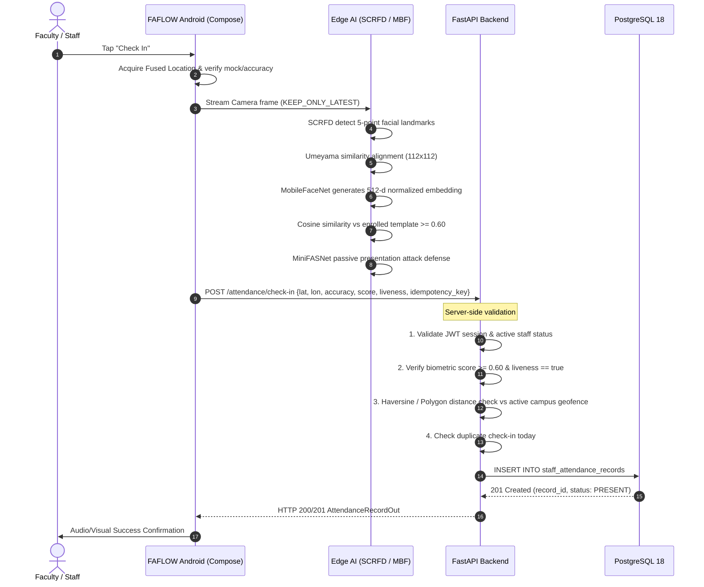

# FAFLOW — End-to-End System Architecture

**Company:** GOVERNENCE  
**Product:** FAFLOW  
**Developer:** KAMESHGOVINDHAN  

---

## 1. Architectural Philosophy

FAFLOW is architectured around three fundamental principles:
1. **Zero Client Trust for Authorization:** The mobile client is a collection of sensors (Camera, GPS, Device Integrity). No client-side boolean flag can ever authorize attendance.
2. **Edge Processing for Privacy & Speed:** Heavy deep-learning inferences (face detection, 5-point alignment, embedding vector generation) are executed on-device via ONNX Runtime to protect biometric privacy and guarantee sub-second latency.
3. **Strict Transactional Consistency:** The PostgreSQL database acts as the single source of truth with foreign key constraints, check constraints, and unique attendance dates per staff member.

---

## 2. End-to-End Information Flow

---

## 3. Subsystem Breakdown

### 3.1 Android Client Subsystem (`com.governence.faflow`)
- **UI Layer:** Jetpack Compose Material 3 with dedicated theme tokens (`FaflowDesignTokens.kt`).
- **Camera & Sensing:** CameraX `ImageAnalysis` configured with `STRATEGY_KEEP_ONLY_LATEST`, zero-copy direct byte buffers.
- **Biometric Pipeline:** 
  - `ScrfdFaceDetector` (ONNX Runtime): 500M parameter model with anchors at strides 8, 16, 32.
  - `UmeyamaAligner`: 2D affine/similarity transformation mapping 5 keypoints to canonical 112x112 coordinates.
  - `ArcFaceEmbedder` / `MobileFaceNet`: Outputting $L_2$-normalized 512-dimensional vector.
  - `ActiveLivenessDetector` / `MiniFASNet`: Multi-frame gesture verification and passive anti-spoofing.
- **Data & Sync:** Room Database + `AttendanceRepositoryImpl` + `AttendanceSyncWorker` (WorkManager) with exponential retry backoff.

### 3.2 Backend Service Subsystem (`app`)
- **API Router Layer:** FastAPI 0.139 endpoints organized by domain with strict Pydantic schemas.
- **Security & RBAC:** OAuth2 Bearer token (JWT), Passlib Bcrypt hashing, role gates (`require_system_admin`, `require_admin`, `require_teacher`, `require_manager`).
- **Geofence Engine:** `GeofenceService` supporting:
  - Circular geofences: Great-circle distance calculated via Haversine formula with configurable tolerance.
  - Polygonal geofences: Ray-casting algorithm for complex multi-vertex campus boundaries.
- **Persistence:** SQLAlchemy 2.0 ORM connected to PostgreSQL 18 with connection pooling and automated schema sync.

### 3.3 Administration & Web Portal Subsystem
- **Frontend Stack:** React 18, Vite 5, React Router, Canvas, CSS Modules.
- **Google Maps Integration:** Isolated strictly to administrative geofence creation/editing. Uses Google Maps JavaScript API with radius handles and polygon vertex manipulation. No maps overhead on mobile attendance screens.
