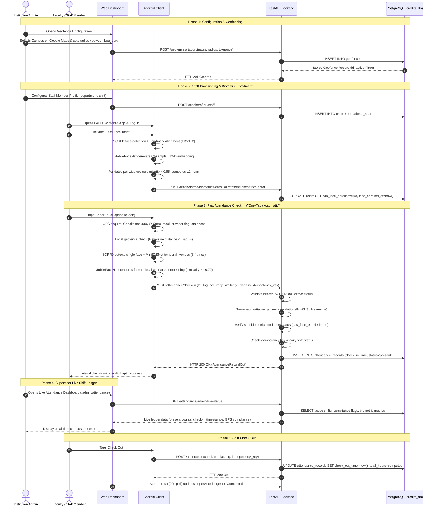

# FAFLOW — Comprehensive UI/UX, Navigation & Endpoint Discovery Audit

**Company:** GOVERNENCE  
**Product:** FAFLOW  
**Developer:** KAMESHGOVINDHAN  
**Date:** September 2026  
**Scope:** Complete ecosystem audit covering Web Frontend (`frontend/`), Backend (`backend/`), Database Schema (`credits_db`), and Android Client (`android/`).

---

## 1. Executive Summary & Inventory Totals

| Dimension | Total Discovered | Operational Status |
| :--- | :--- | :--- |
| **Backend Endpoints (Operations)** | **226** | 226 registered across 25 FastAPI routers and 188 URL paths. |
| **Frontend Screen / Page Files** | **55** | 55 JSX modules in `frontend/src/pages/` and submodules. |
| **Frontend Registered Routes** | **37** | 37 distinct navigable routes mapped in `App.jsx`. |
| **Frontend API Calls Cataloged** | **205** | 202 exact backend matches, 1 path mismatch (`/attendance/summary/today` vs `/attendance/today`). |
| **Android Retrofit Calls** | **42** | 40 exact backend matches, 2 legacy mismatches (`GET timetable/`, `DELETE leaves/{id}`). |
| **Supported User Roles** | **8** | `system_admin`, `admin` (HOD), `teacher`, `principal`, `manager`, `lab_staff`, `non_teaching_staff`, `governance`. |
| **Database Relational Tables** | **41** | Normalized PostgreSQL 18 schema with foreign key constraints. |

---

## 2. Complete Role-Based Access Control (RBAC) Matrix

FAFLOW defines 8 distinct user roles in `app.models.user.Role`:

| Role Name | Scope | Key Capabilities | Nav Menu Assigned |
| :--- | :--- | :--- | :--- |
| **`system_admin`** | Global Institutional | Geofences, Biometrics, Departments, Managers, System Metrics, Data Retention, Global Backups, Audit Logs. | `SYSTEM_ADMIN_NAV` |
| **`admin` (HOD)** | Departmental | Faculty, Department Classes, Subjects, Rooms, Timetable Upload/Approvals, Leave Review, Admin Leave Entry, Credits. | `ADMIN_NAV` |
| **`teacher`** | Academic Faculty | Timetable view, Class Timetable, Apply Leave, Leave History, Manage Substitutes, Today's Coverage, My Credits, Preferences. | `TEACHER_NAV` |
| **`principal`** | Institutional Read-Only | Institutional Dashboard, Classwise Timetable, Department oversight. Read-only on mutative routes. | `PRINCIPAL_NAV` |
| **`manager`** | Operational Supervision | Operational Staff (Lab & Non-Teaching), Staff Directory, Staff Leaves & Ledger, Credit adjustments. | `MANAGER_NAV` |
| **`lab_staff`** | Operational Staff | Lab workspace, assigned room schedules, leave applications, credit ledger. | `STAFF_NAV` |
| **`non_teaching_staff`**| Operational Staff | Duty workspace, leave applications, credit ledger. | `STAFF_NAV` |
| **`governance`** | Institutional Trust Oversight | Command Center, Live Substitutions, Leave Oversight, Emergency Backups, Audit logs. | `GOVERNANCE_NAV` |

---

## 3. Complete Frontend Screen & Route Inventory

| Screen Name | Route in `App.jsx` | User Roles | Primary Purpose & Actions | Backing APIs |
| :--- | :--- | :--- | :--- | :--- |
| **Login** | `/login` | Public / Guest | Authenticate via username/password or email. Stores JWT access + refresh tokens. | `POST /auth/login` |
| **Register** | `/register` | Public / Guest | Institutional user registration (role selection, department assignment). | `POST /auth/register` |
| **FirstLoginSetup** | `/first-login-setup` | All New Users | Forces default password change upon first login. | `POST /auth/setup-credentials` |
| **AdminDashboard** | `/admin/dashboard` | `admin`, `system_admin` | Department stats (HOD) or Global overview (Users, Depts, Audit, Traffic). | `GET /admin/users/global`, `GET /admin/system-analytics` |
| **SetupGuide** | `/admin/setup` | `admin`, `system_admin` | Step-by-step institutional bootstrap wizard. | Multi-service verification |
| **AcademicCalendar** | `/admin/academic-calendar` | `admin`, `system_admin`, `governance` | Term dates, semester setup, day orders (Day 1-6), holidays. | `GET/POST /academic-calendar/` |
| **CalendarReports** | `/admin/academic-calendar/reports` | `admin`, `system_admin` | Working days calculation, syllabus progress reports. | `GET /academic-calendar/reports` |
| **Teachers** | `/admin/teachers` | `admin`, `system_admin` | Faculty CRUD, bulk CSV upload, workload balance. | `GET/POST/PUT/DELETE /teachers/` |
| **AdminTimetable** | `/admin/timetable` | `admin`, `system_admin` | Department grid matrix, manual slot override, reset timetable. | `GET/POST /timetable/` |
| **TimetableApprovals** | `/admin/timetable/approvals`| `admin`, `system_admin` | Review and bulk-approve pending faculty timetable submissions. | `GET/POST /timetable/submissions/` |
| **AdminLeaves** | `/admin/leaves` | `admin`, `governance` | Review faculty leave requests, approve/reject, substitution tracking. | `GET/POST /leaves/` |
| **AdminLeaveEntry** | `/admin/leave-entry` | `admin` | HOD applies and approves leave on behalf of a teacher. | `POST /leaves/admin-create` |
| **AdminCredits** | `/admin/credits` | `admin` | Balance table, KPI cards, leaderboard, credit history drawer. | `GET/POST /credits/` |
| **Subjects** | `/admin/subjects` | `admin`, `system_admin` | Subject catalog CRUD, course code, credits, archive toggle. | `GET/POST/PUT/DELETE /subjects/` |
| **Classes** | `/admin/classes` | `admin`, `system_admin` | Class sections CRUD, semester, assigned default room. | `GET/POST/PUT/DELETE /classes/` |
| **ClassDirectory** | `/admin/class-directory` | `admin`, `system_admin` | Directory of faculty mapped to classes. | `GET /classes/`, `GET /teachers/` |
| **ClasswiseTimetable**| `/admin/class-timetable` | `admin`, `teacher`, `principal` | Read-only weekly schedule for a selected student section. | `GET /timetable/class/{id}` |
| **Departments** | `/admin/departments` | `system_admin` | Department CRUD, code, head of department mapping. | `GET/POST/PUT/DELETE /departments/` |
| **Rooms** | `/admin/rooms` | `admin`, `system_admin` | Room & laboratory directory, capacity, availability lookup. | `GET/POST/PUT/DELETE /rooms/` |
| **ResourceAvailability** | `/admin/resource-availability` | `admin` | Real-time conflict-free room finder by period and day order. | `GET /rooms/availability` |
| **TodaySubstitutions** | `/admin/today-substitutions` | `admin`, `teacher`, `governance` | Live board of today's active period coverage and substitute teachers. | `GET /substitutions/today` |
| **AdminSettings** | `/admin/settings` | `admin`, `system_admin`, `governance` | Institution branding, period timings, audit logs. | `GET /settings/public`, `GET /admin/audit-logs` |
| **BackupRestore** | `/admin/backup` | `admin`, `system_admin`, `governance` | Full/department JSON backup export, manual upload, restore engine. | `GET/POST /backup/` |
| **Geofences** | `/admin/geofences` | `system_admin` | Google Maps & Satellite interactive campus perimeter editor. | `GET/POST/PUT/DELETE /geofences/` |
| **Biometrics** | `/admin/biometrics` | `system_admin` | Faculty face enrollment status audit and biometric template reset. | `GET /teachers/`, `POST /teachers/{id}/biometrics/reset` |
| **Managers** | `/admin/managers` | `system_admin` | CRUD for operational staff managers and department assignment. | `GET/POST/PUT/DELETE /admin/managers/` |
| **SystemMetrics** | `/admin/system-metrics` | `system_admin` | Real-time HTTP traffic monitoring, latency histogram, IP tracker. | `GET /admin/system-metrics` |
| **DataRetention** | `/admin/data-retention` | `system_admin` | Audit log pruning, historical purge policies, dry-run simulation. | `GET/POST /data-retention/` |
| **GovernanceDashboard**| `/governance` | `governance` | Emergency override, cross-department substitution command center. | `GET /governance/overview` |
| **HodTimetable** | `/governance/timetable` | `governance` | Cross-department master timetable inspection. | `GET /governance/timetable` |
| **PrincipalDashboard** | `/principal/dashboard` | `principal` | Executive college-wide KPI metrics and department summaries. | `GET /principal/overview` |
| **ManagerDashboard** | `/manager/dashboard` | `manager` | Operational staff attendance, leave statistics, lab duty coverage. | `GET /manager/dashboard` |
| **ManagerLabStaff** | `/manager/lab-staff` | `manager` | Laboratory technician directory and room allocation. | `GET/POST/PUT/DELETE /manager/staff` |
| **NonTeachingStaff** | `/manager/non-teaching-staff`| `manager` | Office, administrative, and maintenance staff records. | `GET/POST/PUT/DELETE /manager/staff` |
| **ManagerStaffLeaves**| `/manager/leaves` | `manager` | Approve/reject staff leaves, quota adjustment, credit ledger. | `GET/POST /manager/leaves/` |
| **StaffDirectory** | `/manager/directory` | `manager` | Filterable operational staff directory. | `GET /manager/staff` |
| **StaffDashboard** | `/staff/dashboard` | `lab_staff`, `non_teaching_staff` | Personal work shift, lab duty calendar, leave summary. | `GET /staff/dashboard` |
| **StaffMyLeaves** | `/staff/leaves` | `lab_staff`, `non_teaching_staff` | Apply for staff leave, cancellation, view personal credit ledger. | `GET/POST/DELETE /staff/leaves` |
| **TeacherDashboard** | `/teacher/dashboard` | `teacher` | Today's schedule, pending leaves, substitution duties today. | `GET /teachers/me`, `GET /academic-calendar/my-today-summary` |
| **MyTimetable** | `/teacher/timetable` | `teacher` | Personal weekly class matrix with room and section details. | `GET /timetable/teacher/{id}` |
| **ApplyLeave** | `/teacher/leave/apply` | `teacher` | Single/batch period leave application with auto-substitute preview. | `POST /leaves/`, `POST /leaves/batch` |
| **LeaveHistory** | `/teacher/leaves` | `teacher` | Status of submitted leaves, cancellations, substitute remarks. | `GET /leaves/my`, `POST /leaves/{id}/cancel` |
| **TeacherSubstitution**| `/teacher/substitution` | `teacher` | Autonomous vs manual substitution mode, peer preferences. | `GET/POST /teacher/substitution/` |
| **MyCredits** | `/teacher/credits` | `teacher` | Earned/utilized substitution duty credits ledger. | `GET /credits/my` |
| **Preferences** | `/teacher/preferences` | `teacher` | Willingness and period preference for taking substitution duty. | `PUT /teacher/substitution/config` |

---

## 4. Complete Backend Endpoint Catalog (226 Endpoints)

### 4.1 Authentication (`/auth`) — 2 Endpoints
* `POST /auth/login`: Issue JWT token pair (`username`, `password`).
* `POST /auth/setup-credentials`: Mandatory initial credential onboarding.

### 4.2 Staff Attendance (`/attendance`) — 5 Endpoints
* `POST /attendance/check-in`: Authenticated biometric check-in with server-authoritative geofence verification.
* `POST /attendance/check-out`: Authenticated biometric check-out with server-authoritative geofence verification.
* `GET /attendance/today`: Authenticated user's shift status and check-in/out timestamps for today.
* `GET /attendance/my`: Paginated historical attendance records for caller.
* `GET /attendance/admin/live-status`: Real-time supervisor ledger (checked-in, checked-out, absent, anomalies).

### 4.3 Campus Geofences (`/geofences`) — 8 Endpoints
* `POST /geofences/test-location`: Calculate distance, containment, and radius tolerance for arbitrary GPS coordinates.
* `GET /geofences/active`: List active campus perimeters for mobile devices.
* `GET /geofences/`: List all geofences with admin metadata.
* `GET /geofences/{geofence_id}`: Retrieve single geofence definition.
* `POST /geofences/`: Create new circular or polygonal campus boundary (`system_admin` only).
* `PUT /geofences/{geofence_id}`: Update geofence boundary or radius (`system_admin` only).
* `PATCH /geofences/{geofence_id}/toggle`: Activate or deactivate geofence (`system_admin` only).
* `DELETE /geofences/{geofence_id}`: Soft-delete campus geofence (`system_admin` only).

### 4.4 Teachers (`/teachers`) — 9 Endpoints
* `GET /teachers/`: List department or cross-department faculty.
* `POST /teachers/`: Register individual teacher.
* `POST /teachers/bulk`: Batch upload faculty via CSV.
* `GET /teachers/me`: Retrieve authenticated teacher's profile.
* `POST /teachers/me/biometrics/enroll`: Confirm personal on-device face enrollment.
* `GET /teachers/{teacher_id}`: Retrieve teacher details.
* `PUT /teachers/{teacher_id}`: Update teacher details.
* `DELETE /teachers/{teacher_id}`: Deactivate teacher account.
* `POST /teachers/{teacher_id}/biometrics/reset`: Reset biometric profile (`system_admin` only).
* `GET /teachers/{teacher_id}/credits`: Retrieve teacher's credit balance.

### 4.5 Leaves & Autonomous Substitution (`/leaves`) — 20 Endpoints
* `POST /leaves/`: Submit single period leave request.
* `POST /leaves/batch`: Submit multi-period or whole-day leave request.
* `GET /leaves/`: List leaves with filters (`date`, `teacher_id`, `status`).
* `GET /leaves/my`: List authenticated teacher's leave requests.
* `POST /leaves/admin-create`: Admin applies and auto-approves leave for a teacher.
* `PATCH /leaves/{leave_id}/approve`: HOD approves leave request.
* `PATCH /leaves/{leave_id}/reject`: HOD rejects leave request with remarks.
* `POST /leaves/{leave_id}/cancel`: Teacher cancels future or morning leave.
* `POST /leaves/{leave_id}/admin-cancel`: Admin cancels leave with mandatory audit reason.
* `GET /leaves/{leave_id}/cancel-impact`: Preview affected substitute assignments.
* `POST /leaves/{leave_id}/lock`: Lock substitute assignment to prevent autonomous re-routing.
* `GET /leaves/{leave_id}/free-teachers`: Query available teachers free during affected period.
* `GET /leaves/{leave_id}/candidates`: Query ranked substitute recommendations.
* `POST /leaves/{leave_id}/assign/{substitute_id}`: Assign substitute teacher.
* `PUT /leaves/{leave_id}/override/{substitute_id}`: Admin manually overrides assigned substitute.
* `POST /leaves/{leave_id}/undo-assignment`: Revert substitute assignment to unassigned.
* `POST /leaves/bulk-action`: Batch approve/reject leaves.
* `GET /leaves/calendar-summary`: Monthly leave count for calendar overlays.

### 4.6 Timetable (`/timetable`) — 13 Endpoints
* `POST /timetable/`: Bulk upload timetable matrix for department.
* `POST /timetable/slot`: Create single timetable slot.
* `GET /timetable/class/{class_id}`: Fetch weekly grid for student section.
* `GET /timetable/teacher/{teacher_id}`: Fetch weekly grid for individual teacher.
* `DELETE /timetable/{slot_id}`: Remove specific timetable slot.
* `DELETE /timetable/teacher/{teacher_id}`: Clear all slots for a teacher.
* `POST /timetable/reset`: Granular timetable purge (all, department, or teacher list).
* `POST /timetable/submissions`: Faculty submits personal timetable proposal.
* `GET /timetable/submissions/my`: List my submitted timetable entries.
* `GET /timetable/submissions/pending`: HOD review queue of unapproved entries.
* `POST /timetable/submissions/{id}/review`: Approve/reject submitted slot.
* `POST /timetable/submissions/bulk-review`: Bulk approve/reject submitted slots.
* `DELETE /timetable/submissions/{id}`: Cancel pending timetable submission.

### 4.7 Academic Calendar & Day Orders (`/academic-calendar`) — 19 Endpoints
* Academic year CRUD, Semester CRUD, Holiday calendar, Day Order (Day 1-6) resolver, and schedule reports.

### 4.8 Operational & Manager Portal (`/manager`) — 15 Endpoints
* Operational staff directory, lab staff, non-teaching staff, staff leave approval, staff quota adjustments, staff credit ledger.

### 4.9 Staff Self-Service Portal (`/staff`) — 6 Endpoints
* `GET /staff/me`, `GET /staff/dashboard`, `POST /staff/leaves`, `GET /staff/leaves`, `DELETE /staff/leaves/{id}`, `GET /staff/ledger`.

### 4.10 Governance Control Plane (`/governance`) — 20 Endpoints
* Real-time campus overview, cross-department emergency override, institution-wide substitution audits, master timetable view.

### 4.11 Administration, Security & Backups — 50+ Endpoints
* `/admin/*`: Global users, departments, managers, system metrics, audit logs.
* `/backup/*`: JSON export, import, restore, index management, pre-restore snapshots.
* `/data-retention/*`: Historical purge policies, dry-run simulation, automated retention cleanup.
* `/rooms/*`: Room & lab CRUD, conflict check, availability queries.
* `/subjects/*`: Subject catalog, course codes, archiving.
* `/classes/*`: Class sections, semester assignments.
* `/credits/*`: Duty credit transactions, leaderboard, balance auditing.
* `/notifications/*`: Web push subscriptions, push dispatch, notification inbox.
* `/health`: Health check (`{"status": "ok", "service": "FAFLOW API"}`).
* `/settings/public`: Unauthenticated institutional branding (`app_name`, `periods_per_day`, `departments`).

---

## 5. UI/UX Gap Analysis & Remediation Findings

### 5.1 Critical Mismatch 1: Web Attendance Ledger Missing
- **Finding:** The backend provides `GET /attendance/admin/live-status` (real-time supervisor ledger with checked-in, checked-out, absent counts, and active shifts) and `GET /attendance/my` (personal attendance history), but the web frontend had NO dedicated Attendance page or navigation item.
- **Impact:** Administrators could only view attendance via mobile devices or API clients.
- **Remediation:** Create a dedicated, responsive **Live Attendance & Shift Monitoring** page in the web admin (`/admin/attendance`), wire it into `navConfig.jsx` for `ADMIN_NAV` and `SYSTEM_ADMIN_NAV`, and add it to `api/services.js`.

### 5.2 Critical Mismatch 2: Role Authorization Gate in `attendance_service.py`
- **Finding:** Line 249 of `attendance_service.py` checked:
  `allowed_roles = ["admin", "super_admin", "principal", "hod", "manager"]`
  using `getattr(current_user, "role", "").lower()`.
- **Bug:** `current_user.role` is an enum (`Role.system_admin`), so `Role.system_admin.value` is `"system_admin"`. Because `"super_admin"` was written instead of `"system_admin"`, genuine System Administrators received an HTTP 403 Forbidden! Furthermore, `Role.governance` was missing from `allowed_roles`.
- **Remediation:** Update `allowed_roles` to use canonical enum values: `[Role.admin.value, Role.system_admin.value, Role.principal.value, Role.manager.value, Role.governance.value]`.

### 5.3 Critical Mismatch 3: Frontend API Path in `services.js`
- **Finding:** In `frontend/src/api/services.js` (line 308), `biometricsApi.getAttendanceToday` was calling `/attendance/summary/today`, whereas the FastAPI backend endpoint is `/attendance/today`.
- **Remediation:** Correct the URL path in `api/services.js` to `/attendance/today` and introduce a dedicated `attendanceApi` service module.

### 5.4 Android Retrofit Contract Alignment
- **Finding:** In `FaflowApiService.kt`:
  - `@GET("timetable/")` called `GET /timetable/` which only accepted `POST`.
  - `@DELETE("leaves/{leave_id}")` called `DELETE /leaves/{id}` which was routed at `POST /leaves/{id}/cancel`.
- **Remediation:** 
  1. Add `GET /timetable/` endpoint in backend `routes/timetable.py` supporting optional query filters (`class_id`, `teacher_id`, `department_id`, `day_order`).
  2. Add `DELETE /leaves/{leave_id}` in `routes/leaves.py` as an alias delegating to `cancel_leave_by_teacher`.

---

## 6. Implementation Plan & Workflows

1. **Backend Contract Enhancements:**
   - Fix role authorization check in `AttendanceService.get_supervisor_live_status` to include `Role.system_admin` and `Role.governance`.
   - Add `GET /timetable/` query endpoint to `routes/timetable.py`.
   - Add `DELETE /leaves/{leave_id}` alias endpoint to `routes/leaves.py`.
2. **Frontend Service Synchronization:**
   - Update `frontend/src/api/services.js` to add canonical `attendanceApi` (`getSupervisorLiveStatus`, `getToday`, `getMyHistory`, `checkIn`, `checkOut`).
3. **Frontend Screen Implementation:**
   - Implement `frontend/src/pages/admin/Attendance.jsx` featuring real-time presence metric cards (Present, Checked Out, Absent, Shift Duration, Geofence Verification Status), live search, department filtering, and auto-refresh.
   - Register route `/admin/attendance` in `App.jsx` under `AdminRoute`.
   - Add "Live Attendance" to `ADMIN_NAV`, `SYSTEM_ADMIN_NAV`, `PRINCIPAL_NAV`, and `GOVERNANCE_NAV` in `navConfig.jsx`.
4. **Verification & Testing:**
   - Run backend `pytest` suite (verify all 479 tests pass).
   - Run frontend `npm run build` (verify clean Vite bundle, 556 modules).
   - Run Android `testDebugUnitTest` (verify all 94 tests pass).

---

## 7. End-to-End Cross-Layer Lifecycle & Failure Cases Matrix

FAFLOW operates as a single, coherent, production-grade product across all three tiers:

### 7.1 Cross-Layer Failure Case Handling Matrix

| Failure Case | Detection Layer | Enforcement & Recovery Mechanism | User / Admin Feedback |
| :--- | :--- | :--- | :--- |
| **1. No Active Geofence** | Backend & Android | Android fallback to server query; Backend rejects with `HTTP 400 No active geofences configured for campus`. | "Institutional geofence not configured. Please contact administrator." |
| **2. Outside Geofence** | Android & Backend | Android displays exact distance to perimeter; Backend calculates Haversine/Polygon and rejects with `HTTP 400 Outside authorized campus perimeter`. Zero bypasses allowed. | Warning card with retry button: "You are X meters outside the campus perimeter." |
| **3. Poor GPS Accuracy (> 50m)** | Android & Backend | Android evaluates `accuracyMeters > 50.0f`; Backend enforces `accuracy_meters <= 50.0` check. | "Improving location accuracy... Please move to an area with clear sky view." |
| **4. Mock / Spoofed GPS** | Android Client | Android checks `location.isFromMockProvider` and test-provider flags. Immediately suspends capture. | Red badge: "Simulated / Mock location detected. Real physical presence required." |
| **5. Stale GPS Location** | Android Client | Android validates `System.currentTimeMillis() - location.time < 30000ms`. Triggers fresh GPS fix. | "Refreshing location coordinates..." |
| **6. Face Mismatch (< 0.70)** | Android Client | MobileFaceNet CosineFaceMatcher computes cosine distance. If `< 0.70`, locks capture and rejects. | "Face not recognized. Please ensure your face is well-lit and unobstructed." |
| **7. Face Not Detected** | Android Client | SCRFD detector outputs 0 bounding boxes. Viewfinder displays guidance oval. | "Position your face inside the guide oval." |
| **8. Liveness Failure (Spoof/PAD)** | Android Client | MiniFASNet PAD model detects photo, screen replay, or paper mask; `gestureConfirmFrames` requires 3 consecutive live frames. | "Liveness verification failed. Please look straight at the camera." |
| **9. Network Failure / Offline** | Android Client | `AttendanceRepository` catches network timeout and writes record to local encrypted SQLite queue (`AttendanceLocalQueue`). Background WorkManager syncs upon reconnect. | Yellow badge: "Check-in verified locally. Queued for automatic institutional synchronization." |
| **10. Duplicate Attendance Request** | Backend | Backend validates `idempotency_key` and rejects duplicate check-ins for the same shift (`HTTP 400 Staff already checked in for today`). | "Attendance already recorded for this shift." |
| **11. Unauthorized User** | Backend | `get_current_user` validates JWT signature, expiration, and active status (`is_active=True`). Returns `HTTP 401 Unauthorized` or `403 Forbidden`. | Redirects to login with session expired dialog. |
| **12. Invalid / Corrupted Request** | Backend | FastAPI Pydantic schema validation rejects malformed payload with `HTTP 422 Unprocessable Entity`. | "Invalid verification payload." |

